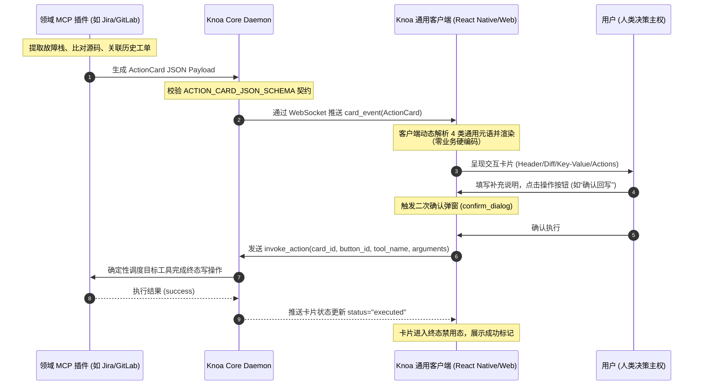
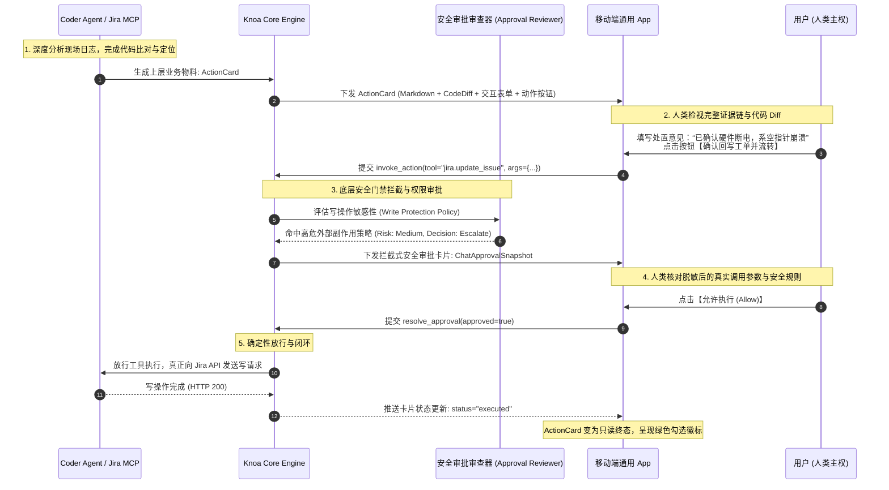
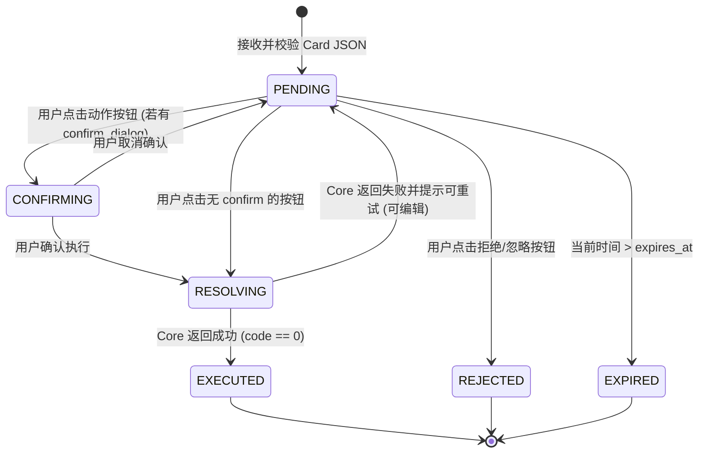

# Knoa 通用 Action Card 声明式渲染规范 (Client Renderer Specification)

> **文档版本**：1.0（已定稿）  
> **适用终端**：Knoa Mobile App (React Native)、Web 客户端、桌面端及第三方适配器  
> **核心原则**：通用基座零业务侵入，100% 声明式驱动 (Server-Driven UI)

---

## 1. 概述与核心架构 (Overview & Architecture)

### 1.1 架构宗旨：严禁针对垂直业务做前端定制
Knoa 的终端客户端（Mobile App / Web Console）是宿主系统的**个人通用 AI OS 交互基座**。
- **反模式痛点**：若在客户端中为 Jira 编写专用的 `JiraTicketScreen`、为 GitLab 编写专用的 `MergeRequestScreen`、或为现场机器人编写专用的 `RobotMonitorView`，前端将迅速退化为不可维护的臃肿业务客户端，发布周期与维护成本急剧攀升。
- **架构方案**：全量采用 **Server-Driven UI (SDUI)** 范式。一切复杂的领域逻辑、故障排查、日志解包由后端的独立 MCP 插件（如 `jira_mcp_server`）与专职 Agent 完成；当需要人类决策或审阅物料时，统一输出符合 `knoa_platform.action_card` 标准 Schema 的 Action Card JSON。
- **客户端定位**：客户端仅作为纯粹的**“通用声明式卡片渲染器”**，对 Jira、GitLab、云原生部署等业务保持 **100% 零知识、零硬编码、零依赖**。

### 1.2 端到端交互闭环 (End-to-End Sequence)



---

### 1.3 核心辨析：Action Card 与底层权限审批 (Permission Approval) 的本质区别

系统开发者最常产生的疑问是：*“系统已经有了 `ChatApprovalCard` 权限审批，为什么还要引入 `ActionCard`？”*  
两者处于完全不同的架构抽象层级，协同工作而非互相替代：

| 维度 | 底层权限审批 (`Permission Approval`) | 上层业务卡片 (`Action Card`) |
| :--- | :--- | :--- |
| **本质定位** | **执行前安全防火墙 (Pre-execution Firewall)** | **执行后业务交付与决策看板 (Post-analysis Deliverable)** |
| **触发时机** | Agent 准备调用某个高危工具（如 `shell.run_command`、`git.push`）的前一秒，被安全策略**拦截并挂起** | Agent 跑完了复杂的诊断分析（解包、搜索、比对源码、抓取 Git blame），需要向人类**交付物料成果** |
| **决策语义** | **严格二元对立**：`Allow` (放行) 或 `Deny` (拦截) | **多元业务决策**：可包含主行动（确认回写）、次级行动（转派）、否定行动（暂不处理） |
| **交互能力** | 仅供审阅工具参数；**不支持用户输入反馈或附加说明** | **支持嵌入通用表单控件**（输入框、下拉框、开关），支持人类补充处置意见后随调用一同回写 |
| **内容表现力** | 工具名、目标参数文本、脱敏参数、安全规则说明 | 富文本 Markdown 报告、结构化 Key-Value 网格、代码 Diff 高亮、产物附件链接、警告 Callout |
| **关注核心** | **系统安全合规**（“这个底层系统调用是否危险，准不准跑？”） | **业务价值闭环**（“这个复杂问题的排查结论是什么，下一步怎么处理？”） |

#### 协同工作链路：
1. **阶段一（分析与交付）**：Jira MCP 联动 Coder Agent 完成日志排查与源码对比后，组装一张包含代码 Diff 和三段式结论的 **Action Card** 推送到用户手机；
2. **阶段二（人类决策）**：用户在手机上检视代码 Diff，在输入框中填写“已确认现场硬件断电”，然后点击 Action Card 上的 **【确认回写工单并流转】** 按钮；
3. **阶段三（底层安全守护）**：若该动作触发的写工具（如 `jira.add_comment` 或 `git.push`）被平台策略判定为敏感，底层的 **权限审批机制 (Permission Approval)** 将再次作为不可逾越的安全红线生效把关，确保系统绝对受控。

---

### 1.4 实战演练：两者协同联动的端到端真实案例 (End-to-End Collaboration Walkthrough)

以下以工业机器人真实段错误工单（如 `TESTISSUE-125380`）为例，展示 Action Card 成果交付与底层 Permission Approval 安全放行的完整全生命周期：



#### 1.4.1 代码示例：Agent 如何用 ActionCardBuilder 组装业务交付物料

```python
from knoa_platform.action_card import ActionCardBuilder, ActionCardLevel

def build_jira_investigation_card(issue_key: str, robot_sn: str, diff_patch: str) -> dict:
    card = (
        ActionCardBuilder(
            title="现场机器人段错误排查结论与回写草稿",
            level=ActionCardLevel.CRITICAL,
        )
        .set_subtitle(f"工单: {issue_key} · 机器SN: {robot_sn}")
        .set_source(plugin_name="jira", agent_name="coder")
        .add_callout(
            "在 motion_controller.cc:88 捕获到 SIGSEGV 段错误，伴随电机通信超时异常。",
            level="error",
        )
        .add_markdown(
            "### 三段式排查报告 (草稿)\n"
            "1. **现象描述**：机器人上位机在乘梯建图时发生崩溃，进程退出重连；\n"
            "2. **根因分析**：未对电机反馈指针作判空校验，空指针解引用引发段错误；\n"
            "3. **解决方案**：增加判空保护与通信超时重试机制。\n"
        )
        .add_key_value([
            {"key": "影响版本", "value": "v2.6.4-rc1", "style": "code"},
            {"key": "代码责任人", "value": "robotdev@gs-robot.com", "style": "bold"},
            {"key": "提交记录", "value": "4e6d92a: feat(pnc): add timeout check", "style": "muted"},
        ])
        .add_code_diff(
            filename="src/navigation/motion_controller.cc",
            language="cpp",
            unified_diff=diff_patch,
        )
        .add_input(
            id="human_comment",
            label="补充处置说明 (将随工单一同记录)",
            input_type="textarea",
            placeholder="现场已确认电机硬件断电无损...",
            required=False,
        )
        .add_action_button(
            id="btn_writeback",
            label="确认回写工单并流转",
            style="primary",
            tool_name="jira.update_issue",
            arguments={"issue_key": issue_key, "action": "writeback_and_resolve"},
            confirm_dialog={
                "title": "回写确认",
                "message": f"确定将上述三段式结论回写到 {issue_key} 并流转状态吗？",
            },
            include_form_inputs=True,
        )
        .add_action_button(
            id="btn_dismiss",
            label="暂不处理",
            style="outline",
            action_type="dismiss",
        )
        .build()
    )
    return card.to_dict()
```

#### 1.4.2 数据契约对比：ActionCard vs ChatApprovalSnapshot

- **上层 ActionCard Payload (业务看板，由前端通用渲染)**：
```json
{
  "schema_version": "1.0",
  "card_id": "card_diag_125380",
  "title": "现场机器人段错误排查结论与回写草稿",
  "level": "critical",
  "status": "pending",
  "source": { "plugin_name": "jira", "agent_name": "coder", "created_at": 1788889900 },
  "blocks": [
    { "type": "callout", "level": "error", "text": "在 motion_controller.cc:88 捕获到 SIGSEGV 段错误" },
    { "type": "markdown", "content": "### 三段式排查报告 (草稿)\n1. 现象描述..." },
    { "type": "code_diff", "filename": "motion_controller.cc", "unified_diff": "@@ -87,2 +87,5 @@..." }
  ],
  "inputs": [
    { "id": "human_comment", "label": "补充处置说明", "input_type": "textarea" }
  ],
  "actions": [
    { "id": "btn_writeback", "label": "确认回写工单并流转", "style": "primary", "action_type": "invoke_tool", "tool_name": "jira.update_issue" }
  ]
}
```

- **底层 ChatApprovalSnapshot Payload (安全拦截，由平台安全核心接管)**：
```json
{
  "approval_id": "appr_77a91bf",
  "tool_name": "jira.update_issue",
  "arguments": {
    "issue_key": "TESTISSUE-125380",
    "action": "writeback_and_resolve",
    "human_comment": "已确认硬件断电，系空指针崩溃"
  },
  "display": {
    "tool_title": "Jira 工单回写与状态流转",
    "target": "TESTISSUE-125380",
    "risk_level": "medium",
    "summary": "向 Jira 工单写入三段式排查报告并将工单流转至待验证",
    "reviewer_decision": "escalate",
    "reviewer_reason": "检测到对生产系统存在外部副作用的写操作，必须经由人类二次放行"
  }
}
```

**结论**：
- **Action Card** 是用户看到的**完整业务案卷与交互工作台**；
- **ChatApproval** 是当用户在工作台上按下扳机后，系统底层的**安全防走火保险栓**。两者层级分明、互不冗余、紧密咬合。

---

## 2. Action Card 协议核心元语 (UI Primitives Specification)

Action Card 由四大通用交互元语构成，客户端必须严格按照本节规范进行组件映射与布局渲染（代码契约见 `src/knoa_platform/action_card/models.py` 与 `src/knoa_platform/action_card/schema.py`）：

### 2.1 标头与状态元语 (Header & Badge)
包含卡片身份、标题、严重程度等级与生命周期状态。

| 字段 | 类型 | 渲染规范 | 视觉映射 |
| :--- | :--- | :--- | :--- |
| `card_id` | `string` | 唯一识别码（格式 `card_[0-9a-zA-Z_-]+`） | 内部主键，用于请求幂等与操作回传 |
| `title` | `string` | 卡片主标题（1~200 字符），字号 17~18sp，粗体 | 顶部主要标题文字 |
| `subtitle` | `string?` | 副标题/受影响实体描述，字号 13~14sp，次级灰 | 位于主标题下方 |
| `level` | `enum` | 严重程度徽标（Badge） | • `info`：蓝色（常规通知）<br/>• `success`：绿色（验证完成）<br/>• `warning`：橙色（需注意风险）<br/>• `critical`：深红（严重故障/阻断异常） |
| `status` | `enum` | 当前生命周期状态 | • `pending`：高亮待办态，按钮可用<br/>• `approved` / `executed`：置灰只读，展示已执行标记<br/>• `rejected`：置灰并显示已取消<br/>• `expired`：半透明置灰，提示卡片已过期 |
| `source` | `object` | 来源元数据：`plugin_name`、`agent_name`、`created_at`、`expires_at` | 顶部来源小标签（如 `[jira/coder · 5分钟前]`） |

### 2.2 内容块元语 (Content Blocks)
`blocks` 数组保证客户端按顺序渲染的内容流。目前支持 5 种标准多态 Block：

#### 1. `markdown` (富文本块)
- **定义**：`{"type": "markdown", "content": "..."}`
- **渲染规范**：复用通用 Markdown 解析组件（如移动端的 `AppMarkdown`），支持标题层级、无序列表、行内代码、引用段落及加粗文本。

#### 2. `key_value` (结构化键值网格)
- **定义**：`{"type": "key_value", "items": [{"key": "工单号", "value": "TESTISSUE-125380", "style": "code"}]}`
- **渲染规范**：
  - 采用水平双列或流式网格展示。左列为 Key（灰色标签），右列为 Value（高对比度内容）；
  - `style` 支持：`default`（标准）、`bold`（粗体加黑）、`code`（等宽代码背景底色）、`badge`（胶囊徽标）、`muted`（浅灰次级信息）。

#### 3. `code_diff` (代码变更对比块)
- **定义**：`{"type": "code_diff", "filename": "motion_controller.cc", "language": "cpp", "unified_diff": "@@ -87,2 +87,5 @@..."}`
- **渲染规范**：
  - 顶部展示文件名栏与语言标签；
  - 逐行渲染 Unified Diff：新增行（以 `+` 开头）使用淡绿底色（`#dcfce7`）与暗绿文本（`#166534`）；删除行（以 `-` 开头）使用淡红底色（`#fee2e2`）与暗红文本（`#991b1b`）；
  - 行号列必须支持等宽字体对齐；
  - 默认折叠超过 15 行的 Diff，提供“展开查看全部 (+N 行)”按钮。

#### 4. `callout` (警示提示块)
- **定义**：`{"type": "callout", "level": "error", "text": "捕获到 Motor feedback timeout 崩溃堆栈"}`
- **渲染规范**：
  - 左侧带 3px 竖向装饰边条的带圆角卡片；
  - 根据 `level`（`info` | `warning` | `error`）呈现对应的柔和背景底色与左侧警示图标（如 `alert-circle`、`alert-triangle`）。

#### 5. `artifact_link` (产物链接块)
- **定义**：`{"type": "artifact_link", "name": "robot_logs.tar.gz", "url": "https://...", "size_bytes": 1048576, "mime_type": "application/gzip"}`
- **渲染规范**：
  - 渲染为带文件图标的点击项，清晰展示文件名、人性化格式化文件大小（如 `1.0 MB`）；
  - 点击支持调用系统下载管理器或调用外部应用预览。

---

### 2.3 动态表单控制元语 (Form Controls)
`inputs` 数组用于在卡片中收集人类决策意见或附加参数，并在用户点击动作按钮时一并提交：

| 控件类型 (`input_type`) | 属性定义 | 交互行为 |
| :--- | :--- | :--- |
| `text` | `placeholder`, `default_value`, `required` | 单行标准文本输入框 |
| `textarea` | `placeholder`, `default_value`, `required` | 多行文本输入区（最小高度 80dp，自适应换行） |
| `select` | `options: [{"label": "...", "value": "..."}]` | 下拉抽屉或选择弹窗，单项选择 |
| `switch` | `default_value: boolean` | 切换开关（如“是否同步通知现场群”） |

**表单收集与参数合并机制**：
- 客户端在本地维系 Form State：`formValues[input.id] = currentValue`；
- 当触发携带 `include_form_inputs: true` 的按钮时，客户端将 `formValues` 合并至该按钮的 `arguments` 字典中再发送至 Core。

---

### 2.4 交互动作按钮元语 (Action Buttons)
`actions` 数组定义用户可操作的行为集。客户端严禁为特定按钮写死硬编码逻辑，必须严格基于协议反射执行：

- **按钮样式规范 (`style`)**：
  - `primary`：主色填充按钮（强调确认/同意/执行）；
  - `secondary`：次级中性灰按钮（次要操作）；
  - `danger`：危险红色填充按钮（拒绝/回滚/清除）；
  - `outline`：线框镂空按钮（忽略/稍后处理）。
- **动作执行类型 (`action_type`)**：
  1. `invoke_tool`：向 Core 发起标准工具调用请求：
     - `tool_name`：调用的目标 MCP 工具名称（如 `jira.add_comment`）；
     - `arguments`：固定参数字典（已由后端填充完工单号等上下文）；
  2. `open_url`：调用系统浏览器打开指定外链；
  3. `dismiss`：将当前卡片在本地及服务端标记为忽略（不执行外部写操作）。
- **二次阻断确认 (`confirm_dialog`)**：
  - 若字段包含 `{"title": "...", "message": "..."}`，客户端在点击后**必须**弹出原生确认对话框，用户确认后方可发送请求，阻断误触。

---

## 3. 客户端生命周期与状态机 (State Lifecycle)

客户端为每张 Action Card 维系一个本地有限状态机，保证响应的确定性与防重复提交：



### 防重放机制 (Idempotency)
1. 进入 `RESOLVING` 状态时，客户端立即禁用该卡片底部的所有操作按钮，并在被点击按钮上呈现旋转加载指示器（Spinner）；
2. 向 Core 发送请求时，携带 `idempotency_key = `${card_id}_${button_id}_${timestamp}``，防止因网络波动导致双重写入。

---

## 4. React Native 参考组件架构 (Reference Architecture)

在 `apps/knoa-mobile` 项目中，推荐的组件解耦架构如下：

```
apps/knoa-mobile/src/components/action_card/
├── ActionCardView.tsx              // 卡片主容器：状态管理、防重提交、Form状态维系
├── CardHeader.tsx                  // 渲染标头、来源小字、严重级别 Badge 与超时计时器
├── CardBlockRenderer.tsx           // 多态分发器：根据 block.type 映射具体子组件
│   ├── blocks/CardMarkdownBlock.tsx
│   ├── blocks/CardKeyValueBlock.tsx
│   ├── blocks/CardCodeDiffBlock.tsx
│   ├── blocks/CardCalloutBlock.tsx
│   └── blocks/CardArtifactBlock.tsx
├── CardFormRenderer.tsx            // 动态表单组件：TextInput / SelectPicker / Switch
└── CardActionFooter.tsx            // 底部操作按钮栏：样式分发、confirm 弹窗与 loading 态
```

### 主容器组件示例 (伪代码规范)

```tsx
export function ActionCardView({ card, onInvokeAction }: ActionCardViewProps) {
  const [formValues, setFormValues] = useState<Record<string, unknown>>({});
  const [resolvingButtonId, setResolvingButtonId] = useState<string | null>(null);

  const handleActionPress = async (action: ActionCardButton) => {
    if (action.confirm_dialog) {
      const confirmed = await showNativeAlert(action.confirm_dialog.title, action.confirm_dialog.message);
      if (!confirmed) return;
    }

    setResolvingButtonId(action.id);
    try {
      const finalArguments = action.include_form_inputs 
        ? { ...action.arguments, ...formValues } 
        : action.arguments;

      await onInvokeAction({
        card_id: card.card_id,
        action_id: action.id,
        tool_name: action.tool_name,
        arguments: finalArguments,
      });
    } finally {
      setResolvingButtonId(null);
    }
  };

  return (
    <CardContainer status={card.status} level={card.level}>
      <CardHeader card={card} />
      <CardContentList blocks={card.blocks} />
      {card.inputs.length > 0 && (
        <CardFormRenderer inputs={card.inputs} values={formValues} onChange={setFormValues} />
      )}
      <CardActionFooter
        actions={card.actions}
        resolvingId={resolvingButtonId}
        disabled={card.status !== "pending"}
        onPress={handleActionPress}
      />
    </CardContainer>
  );
}
```

---

## 5. 安全与架构合规检验标准 (Acceptance Checklist)

任何客户端在支持 Action Card 时，必须通过以下合规性检验：

- [x] **零业务代码检验**：全局搜索客户端代码库，组件内不得出现特定业务库（如 `jira`、`tempo`、`gitlab`）的字面量或分支逻辑；
- [x] **严格 Schema 校验**：收到未知类型的 Block 时优雅降级忽略，严禁导致客户端白屏崩溃；
- [x] **无动态脚本执行**：严格禁止通过 `eval`、`new Function` 等方式解析卡片数据，所有回调严格走类型化的 `tool_name` 管道；
- [x] **高风险阻断检验**：所有带有外部写操作的按钮，未配置 `confirm_dialog` 必须在平台 Lint 检查中被拦截或阻断；
- [x] **暗黑模式自适应**：Code Diff、Callout 等色值严格遵从 `@/theme` 设计系统 Token，在深色与浅色模式下对比度均达到 WCAG AA 级标准。
