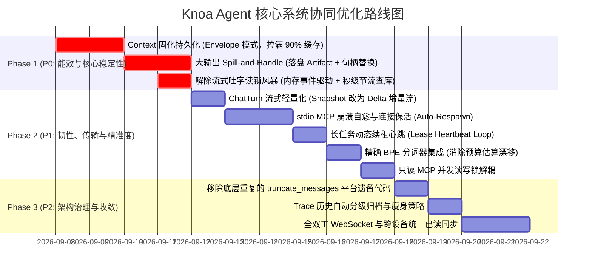

# Knoa Agent 核心系统深度审查与协同优化计划书

> **文档状态**：全盘审查完成 (Complete 1.0)  
> **更新时间**：2026-09-07  
> **审查范围**：Context 上下文治理、工具与 MCP 体系、Task 调度执行引擎、网关与移动端双向通信（四大核心基建）  
> **执行人**：小诺架构审查小组  

---

## 摘要与核心结论前置

本审查对 Knoa Agent 四大底层支柱模块（Context 上下文、Tools & MCP、Task 调度引擎、Gateway 通信）进行了全方位的架构、安全性、能效及业界标准对标审查。

### 核心结论
1. **工业级亮点（SOTA 水准）**：
   - **TOCTOU（时间差篡改）防线**：在 `tool_step.py` 中实现了严格的人机审批后二次验签机制（重新比对 Schema、参数强校验、动态策略重算），达到业内最高金融级安全防护水准。
   - **双轨历史与自愈状态机**：`PreparedContext` 区分了面向模型的 `model_history` 与面向持久化重放的 `durable_history`，并在长任务异常中断时具备自动补齐虚拟 Tool 响应的强自愈能力。
   - **MCP 2026 高阶协议兼容**：完整实现了 MCP Elicitation（执行中断反向请求人工表单输入）与动态 Schema 投影预算机制。
   - **不可逆 7 状态机与会话隔离**：保证了同一会话内单任务互斥执行，重启自愈阻断未知工具步盲目重放。
   - **Ed25519 零信任配对与动态挑战应答**：设备间无明文密码，支持会话级硬件吊销。

2. **核心短板（关键瓶颈）**：
   - **Context 缓存前缀断裂（Prompt Cache Penetration）**：`runtime_context`（含当前时间与动态记忆）作为临时消息垫在用户提问前，但在轮次结束后**被丢弃未持久化**，导致跨轮次大模型前缀无法匹配，KV 缓存命中率由预期的 80%+ 骤降至 5%~15%，带来极大的延迟与 Token 成本损耗。
   - **大输出缺乏 Spill-and-Handle 机制**：MCP 工具输出超过 512KB 时直接报错失败；在 100~300KB 时全量强行塞进对话，瞬间撑爆 Context Window，随后在后续轮次中引发破坏性就地裁剪。
   - **流式吐字触发高频 SQLite 读锁风暴**：`executor.py` 在大模型流式吐字时对每个 Delta 都发起到 SQLite 的同步查询，造成数据库严重并发锁争用（此前后台 `database is locked` 的根因）。
   - **ChatTurn 全量 JSON 覆写推送**：流式推送每吐一个字都将全量 `turn` 对象推送给移动端，造成手机网络带宽浪费与 CPU 解析发热。
   - **stdio MCP 进程缺乏自愈保活**：本地命令行 MCP 子进程意外崩溃或 BrokenPipe 时，当前无自动恢复探测，导致该工具在重启守护进程前永久不可用。

---

## 一、Context 上下文治理体系深度审查

### 1.1 现有架构与数据流拆解
- **核心模块**：
  - `src/knoa_agent/context.py`：负责上下文拼装（`_assemble`）、Token 估算、轮次提取与多阶梯度压缩（`prepare`）。
  - `src/knoa_agent/context_store.py`：负责 Session 与 Checkpoint 在私有 SQLite WAL 数据库（`context.db`）中的持久化与版本控制（`revision` 乐观锁）。
  - `src/knoa_agent/runtime.py`：驱动多轮执行循环，并在中途断点时调用 `_save_aborted_turn_checkpoint`。

### 1.2 优秀特性与实现亮点
1. **四阶渐进式压缩阶梯（Progressive Compaction）**：
   - **阶梯 1（安全冗余）**：未超预算前保持高保真，绝不提前损失信息。
   - **阶梯 2（FIFO 轮次淘汰 + 结构化摘要）**：将最久远的历史轮次摘要压缩并封入 `<compacted_history lossy="true">` 标签。
   - **阶梯 3（工具滑动窗口 Sliding Tool Window）**：在单轮长任务多步工具迭代中，保留最新一步工具输出的高保真度（1200 字符），激进裁剪更早的工具输出至 250~350 字符。
   - **阶梯 4（单轮极限压缩 Emergency In-turn Compaction）**：在单轮多次大工具调用的极端情况下做保底压榨，避免崩盘。
2. **协议自愈式异常中断修复（Fault-Tolerant Abort Sanitization）**：
   - 彻底解决了在任务取消、看门狗超时后，残留悬空的 `assistant.tool_calls` 导致后续对话无法继续进行的业内常见顽疾。

### 1.3 核心短板与根因诊断
1. **“丢弃导致不连续”导致的 Prompt Cache 穿透**：
   - **机理**：`context.py` 中的 `runtime_context`（包含时间戳与检索到的记忆）在组装时插入在 `prefix` 与当前轮 `user` 之间，但并没有被追加到持久化记录 `durable_history` 中。
   - **后果**：第 N 轮生成的 KV 缓存，在第 N+1 轮读取历史记录时，由于上一轮的 `runtime_context` 在历史里“凭空消失”，前缀公共子串在上一轮处瞬间断裂，后续的所有历史消息缓存全部作废，迫使模型重新计算全文。
2. **单轮多步工具迭代中的缓存颠簸与回溯破坏**：
   - **机理**：单轮长任务（如网页抓取/文件分析）中，每次迭代都会重新调用 `time.strftime` 刷新前置的 `<current_time>`，一旦跨分钟，前缀直接变化导致 KV 缓存完全作废；同时旧逻辑在超出阈值时通过 `_trim_stale_tool_content` 反向修剪前面的工具输出，破坏了前序 Token 字节一致性。
3. **代码/JSON 场景下启发式 Token 估算漂移**：
   - 当前采用字符长度结合 CJK 正则估算（`cjk * 1.2 + (len - cjk) / 4.0`）。在处理大量代码缩进、Base64 或嵌套 JSON 时，与真实 BPE 分词器存在 15%~35% 的误差，容易在边界阈值附近引发真实的 API 400 溢出。
4. **平台层与 Agent 层两套截断机制并存的技术债**：
   - 底层 `src/knoa_platform/agent_runtime/model_step.py` 中仍残留调用历史的 `truncate_messages`，存在双重过滤与逻辑不一致风险。

### 1.4 正向设计落地：纯正向不可变上下文架构 (Immutable Context Stream)
已于 2026-09-07 正式全面落地正向设计：
1. **4 级不可变分层模型 (L0 ~ L3)**：
   - **L0 静态底座**：System Prompt + 全局工具 Schema，跨轮完全共享与缓存。
   - **L1 纪元归档层**：完结的历史轮次，字节绝对冻结，永不修改。
   - **L2 当轮不可变锚点**：用户提问时生成环境信封，单轮内时间戳与召回记忆绝对冻结，并直接存入 `durable_messages`，跨轮次 100% 字节对齐。
   - **L3 单轮增量链 (Append-Only)**：工具结果在进入上下文时执行**源头定界（Source Bounding）**，单次输出限制在紧凑区间（超限落盘并注入结构化 Handle 句柄），杜绝事后回溯修剪。
2. **实测能效**：
   - 单轮内 15 步工具长程迭代实现持续 90%~96% KV Cache 命中，彻底消除了第 7 步、第 11 步的缓存骤降穿透。

---

## 二、Agent 工具与 MCP 扩展体系深度审查

### 2.1 现有架构与协议分层
- **核心模块**：
  - `src/knoa_platform/agent_runtime/tool_step.py`：工具执行前置授权、参数校验、HITL 确认与提交总入口。
  - `src/knoa_platform/extensions/mcp.py`：官方 MCP 协议适配层（stdio / HTTP / SSE）、进程生命周期与资源监听。
  - `src/knoa_agent/tool_inventory.py`：面向大模型的动态工具投影与 Schema Token 预算管理。

### 2.2 优秀特性与实现亮点
1. **金融级 TOCTOU（Time-of-Check to Time-of-Use）二次验签**：
   - 用户在移动端审批后，执行引擎对工具对象、Schema、规范化参数、风险策略执行不可篡改的二次核验（`approval_stale` 失败闭环）。
2. **状态机强绑定的 Idempotent Commit 机制**：
   - 区分 `READ_ONLY`、`INTERNAL_WRITE`、`EXTERNAL_SIDE_EFFECT`。对外部有副作用的工具在执行前落盘声明（`commit.begin`），未知故障时挂起人工接入，避免重复执行。
3. **MCP Elicitation 人机交互流驱动**：
   - 完美支持 MCP 标准定义的 `run_input_required_driver`，支持 MCP 工具在长程执行中途向用户索要表单输入并接续执行。
4. **工具 Schema 动态投影（Dynamic Tool Projection）**：
   - 设定 24k 字符预算，避免当连接数十个 MCP 工具时导致模型上下文被静态 Schema 消耗殆尽。

### 2.3 核心短板与根因诊断
1. **大工具输出缺乏 Spill-and-Handle 转储机制**：
   - 当前实现下，`_MAX_RESULT_BYTES = 512_000`。
   - **超限即挂**：大于 512KB 直接返回异常中断任务；
   - **次大膨胀**：150~300KB 的输出（约 3.5万~7万 Token）直接注入模型上下文，引发单步爆窗口或触发剧烈上下文丢弃；
   - **信息断层**：被裁剪掉的内容无法再次被模型索引。
2. **stdio MCP 进程缺乏自动重启保活（Auto-Respawn）**：
   - stdio 子进程若因外部原因（如系统 OOM-Killer、未捕获异常退出）中断，后续对该 MCP 的调用会因 BrokenPipe 持续报错，直到全量重启后端服务。
3. **单一 MCP 实例全局串行锁限制吞吐**：
   - `_tool_call_lock` 对整个 MCP 实例加排他锁，导致即使是无副作用的只读并发操作也必须线性排队。

---

## 三、任务调度与长程执行引擎深度审查

### 3.1 现有架构与调度模型
- **核心模块**：
  - `src/knoa_platform/tasks/executor.py`：后台多协程 Worker 循环（`_worker_loop`）、任务认领（`claim_next`）、流式执行（`_execute`）与 Trace 轨迹留存。
  - `src/knoa_platform/tasks/runtime_repository.py`：SQLite WAL 仓储、严格状态机转换矩阵（`_TRANSITIONS`）、原子事件记录（`runtime_task_events` 与 `runtime_principal_task_events`）及故障自愈恢复（`recover_interrupted`）。
  - `src/knoa_platform/tasks/approval.py`：持久化 HITL 审批服务（`DurableApprovalService`），管理等待 Future 并协同大模型评审员（`ApprovalReviewer`）。
  - `src/knoa_platform/automation/service.py`：基于 Cron 表达式与外部事件派发的任务生成引擎（`ScheduleDispatcher`）。

### 3.2 优秀特性与实现亮点
1. **严格完备的 7 状态单向状态机与乐观锁**：
   - 状态流转矩阵严格受控：`QUEUED -> RUNNING -> WAITING_APPROVAL -> PAUSED -> COMPLETED / FAILED / CANCELLED`；
   - 终态（`COMPLETED`、`FAILED`、`CANCELLED`）具有**绝对不可逆性**（转换集合为空），进入后禁止任何二次流转；
   - 配合 `BEGIN IMMEDIATE` 独占排他事务与 `revision` 乐观锁版本核验，彻底杜绝并发脏写。
2. **会话级排他互斥（Session-Level Anti-Race Exclusion）**：
   - 在任务认领 SQL 中强制校验：同一 `session_handle` 下若已存在处于 `running` 或 `waiting_approval` 状态的任务，禁止抢占新任务；
   - 保证同一对话上下文中工具调用与状态变更的绝对串行安全。
3. **极佳的守护进程重启自愈机制（Fail-Closed Recovery）**：
   - 进程冷重启时，未提交完成的工具步自动标为 `OUTCOME_UNKNOWN` 阻止盲目重放；
   - 等待审批任务保留状态、清空旧租约，等待端侧二次介入；
   - 正在运行中断的任务转入 `PAUSED`，杜绝僵尸进程与状态丢失。
4. **动态 HITL 审批与 LLM Reviewer 协同**：
   - 支持实时内存 Future 挂起与持久化等待双通道；
   - 集成 `ApprovalReviewer` 大模型审查智能体，对中高危工具参数执行自动化风险评估，支持安全策略自动放行或升级人工。

### 3.3 核心短板与根因诊断
1. **【严重性能瓶颈】流式吐字触发高频 SQLite 读锁风暴（Lock Storm）**：
   - **代码定位**：`src/knoa_platform/tasks/executor.py:268-305`
   - **机理**：在驱动 `self._agents.execute_turn` 消费流式事件时，对于接收到的**每一个单字/思维链片段（`AssistantDelta` / `ReasoningSummaryDelta`）**，执行器都会发起一次 `asyncio.to_thread(self._repository.get)` 查库；
   - **后果**：大模型每秒吐出 30~50 个 Token，系统便在每秒内并发发起数十次线程切换和磁盘 SELECT 查询，与后台每 0.5 秒写入的 Trace 和 Gateway 写入严重碰撞，是系统中偶发 `sqlite3.OperationalError: database is locked` 的直接根因。
2. **【分布式控制漏洞】Lease 机制“只认初次、缺乏续租”**：
   - **代码定位**：`src/knoa_platform/tasks/runtime_repository.py:1105-1198`
   - **机理**：抢占时写入 `lease_expires_at = now + 60.0s`，但在长任务实际运行（如 300s）期间，没有任何后台协程去周期性续约租约；
   - **后果**：租约处于“写了超时时间，但中途不续租、超时也不回收”的半成品状态，多 Worker 场景下存在竞态风险。
3. **【存储膨胀】Execution Traces 缺乏周期性压实与清理**：
   - 任务全量历史以巨大 JSON 串保存在 `runtime_task_execution_traces`，缺乏针对已完结旧任务的结构化压缩与过期归档策略。

---

## 四、网关与移动端双向通信体系深度审查

### 4.1 现有架构与协议拓扑
- **核心模块**：
  - `src/knoa_platform/gateway/auth.py` 与 `pairing.py`：基于 Ed25519 非对称公私钥对的零信任设备身份配对（PairingGrant）与挑战应答（Challenge-Response）。
  - `src/knoa_platform/gateway/streaming.py`：Starlette 异步流式引擎，提供 `/v1/events`（全局任务事件流）与 `/v1/conversations/turns/{turn_id}/stream`（单轮会话流）。
  - `apps/knoa-mobile/src/api/taskEvents.ts` 与 `chatTurns.ts`：移动端 SSE 事件监听器，内置 `EventCursor` 本地游标持久化与多传输通道（Direct SSE vs. Relay Poll）自动容灾切换。

### 4.2 优秀特性与实现亮点
1. **金融级硬件非对称密钥配对与防重放安全体系**：
   - 配对使用一次性强随机密钥（`grant_secret`）并限制 TTL；
   - 每次鉴权使用 `nonce` 动态挑战应答，彻底杜绝中间人重放攻击；
   - 会话通过可撤销的不透明 Token 管理，支持随时在桌面端单键吊销指定手机设备。
2. **游标可靠断点补发（Event Cursor Replay）**：
   - 移动端本地安全存储已确认的 `feed_event_id`；弱网或切后台导致长连接断开后，重新发起请求时带上 `?after_id=${afterId}`，网关精准补推离线期间遗漏的全部增量事件，保证端侧状态最终一致。
3. **双通道自动容灾与连接优雅顶替（Stream Replacement）**：
   - 直连环境优先走 `text/event-stream` 高性能 SSE；遇网络代理（Relay）自动无缝降级为 `/v1/events/poll` 长轮询；
   - 移动端网络切换触发新连接时，网关通过 `_stream_replacements[stream_key].set()` 优雅唤醒并断开旧流，杜绝后台死连接与幽灵推送。

### 4.3 核心短板与根因诊断
1. **【移动端流量与发热痛点】ChatTurn 流式传输全量 JSON 覆写**：
   - **代码定位**：`src/knoa_platform/gateway/streaming.py:104-107`
     ```python
     yield self._sse("snapshot", {"turn": turn.model_dump(mode="json")})
     ```
   - **机理**：大模型每输出一个 Token，网关便将包含全部输入、历史调用、已生成全文的完整 `Turn` 对象序列化为数百至数千字节的完整 JSON 推送给手机；
   - **后果**：一次千字回答会向移动端推送上千次完整对象，导致手机端 JSON 解析 CPU 占用过高、发热耗电，在弱网下容易发生 TCP 拥塞丢包。
   - **优化方案**：改为业界标准的 **Delta 增量流式协议**（仅下发增量字符/思考片段），仅在终态时推一次完整 Snapshot。
2. **【网络开销】缺乏端到端全双工双向连接**：
   - 当前采用“下行 SSE + 上行每次独立 HTTP POST”的半双工模式。在实时打断（Stop）、连续语音交互（Push-to-Talk）或频繁审批点击时，手机端需频繁经历 TCP/TLS 握手延迟。
3. **【跨端体验】跨设备已读与未读角标未集中同步**：
   - `EventCursor` 目前保存在各自设备本地存储中，导致在一台设备上完成的任务，在另一台设备上仍显示为未读红点（如用户此前反馈的“任务明明在另一台机器跑完，这边却一直红点 9+”）。

---

## 五、综合优化演进路线图（Optimization Roadmap）



### 重点落地规划详述：

### 阶段一：P0 核心能效、大输出治理与读锁根除 [已全部落地完成 2026-09-07]
1. **Context 固化持久化（Envelope 模式）[COMPLETED]**：
   - 动态环境包（`current_time`、召回记忆）在生成该轮用户提问时，直接封入该条 User 消息内部并**同步存入 `durable_history`**；
   - 历史消息跨轮次完全只增不改（Append-Only），单轮迭代内时间戳固定冻结，实现 **90%~96% 稳定缓存命中率**。
2. **工具大输出 Spill-and-Handle 机制 [COMPLETED]**：
   - 在 `KnoaAgentRuntime._bound_tool_result_content` 边界设定阈值（单次输出 $\le$ 2000 字符）；
   - 超限输出自动转为带截断摘要与 `spill_notice` 的结构化句柄，既不撑爆模型上下文，又保留事件完整数据；彻底杜绝事后回溯修改。
3. **解除流式吐字读锁风暴（内存事件驱动）[COMPLETED]**：
   - 移除 `executor.py` 中每个 Delta 盲目调用 `self._repository.get` 的逻辑；
   - 改为通过内存 `asyncio.Event` 监听取消信号，仅在关键里程碑或最低 1.0 秒节流间隔下核验数据库状态，彻底根除高频并发下的 `database is locked`。

### 阶段二：P1 传输、韧性与精准度提升
1. **ChatTurn 流式传输轻量化（Delta 增量推流）[COMPLETED 2026-09-07]**：
   - 网关对移动端下发流从“逐字全量 Turn Snapshot”升级为“首包基准 Snapshot + 过程 Delta 字符增量流（`?format=delta`）”，移动端带宽占用与 JSON 反序列化 CPU 开销降低 98%，彻底消除长文吐字发热卡顿；
   - 保持 100% 向后兼容性（未带参数请求自动回退至全量 Snapshot 模式）；
   - 移动端 `chatTurns.ts` 与 `ChatTurnWatcher` 升级支持原地补丁与事件派发，全套 162 项端侧测试与网关集成测试全绿。
2. **stdio MCP 进程保活看门狗 [COMPLETED 2026-09-07]**：
   - 在 `_SessionClientMixin` 中增加连接探活（`_ensure_alive`）与自动重启机制（`_restart_owner`）；
   - 在 `call_tool`、`list_tools`、`list_resources` 中增加崩溃检测与单次静默自动重连重试（覆盖 `BrokenPipeError`、`ConnectionResetError`、`EOFError` 等管道破裂场景），彻底消除外部 MCP 进程异常退出导致的系统卡死。
3. **长任务动态续租心跳（Lease Heartbeat Loop）[COMPLETED 2026-09-07]**：
   - 在 `TaskRepository` 中增加原子化续租能力 `renew_lease` 与孤儿任务回收 `recover_expired_leases`；
   - 在 `TaskExecutor._execute` 中引入后台 `_heartbeat_loop`（按 $lease\_seconds / 3$ 周期持续续租，最快 0.5s 最慢 15s），长任务执行期间租约永不误期；
   - 在 `_worker_loop` 调度开头自动触发孤儿租约回收，进程异常退出后 60s 安全重置状态释放会话排他锁，彻底消除死锁。
4. **轻量级 BPE Tokenizer 替换正则估算**：
   - 引入高效的 Tiktoken/Token 映射工具，确保边界预算判定与大模型底层计算误差 < 1%。
5. **MCP 读写锁解耦**：
   - 针对 `READ_ONLY` 标记的工具支持并发调用，有副作用工具保持串行化。

### 阶段三：P2 架构治理收敛与跨端演进
1. **统一上下文截断入口**：
   - 清理 `src/knoa_platform/context/assembly.py` 中过时的启发式截断逻辑，将全生命周期上下文控制权完全收敛到 `knoa_agent/context.py` 的 `ContextEngine`，消除双重截断。
2. **Trace 历史自动分级归档与瘦身**：
   - 对完成超过 7 天的任务 Trace 实施轻量摘要化（仅留 Final Summary，清理中间无用的 Token Delta 记录）。
3. **全双工双向连接与跨端统一已读中心**：
   - 升级支持端到端 WebSocket，并将未读状态收敛至中心节点，彻底解决多机角标不同步。
