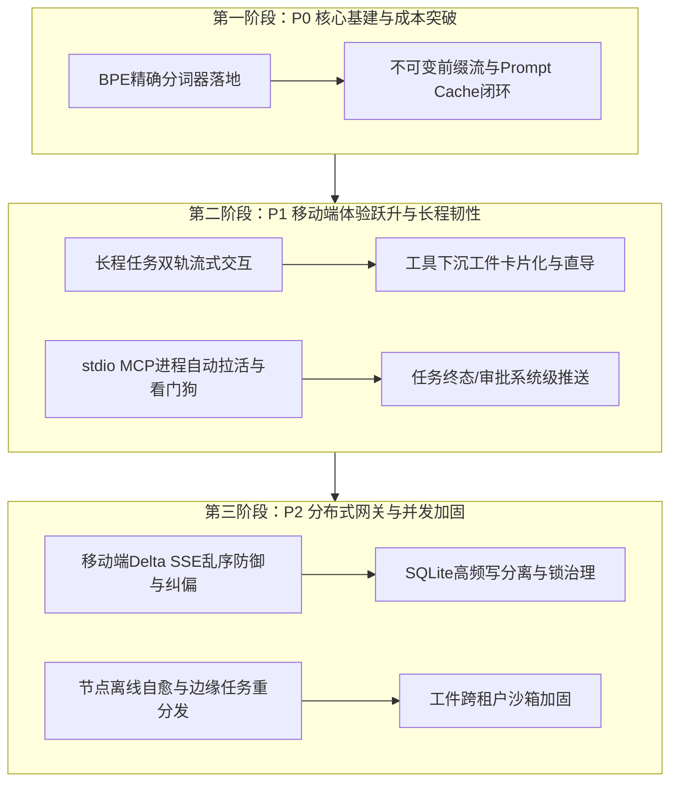
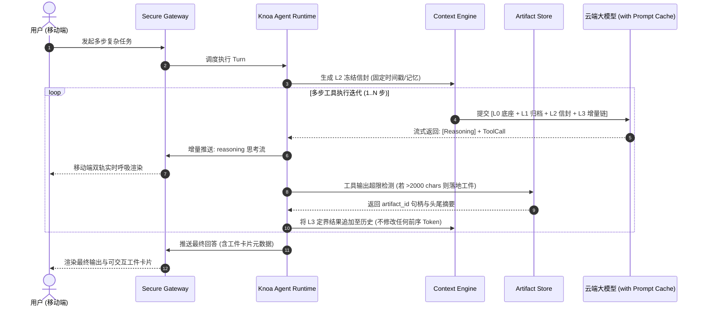
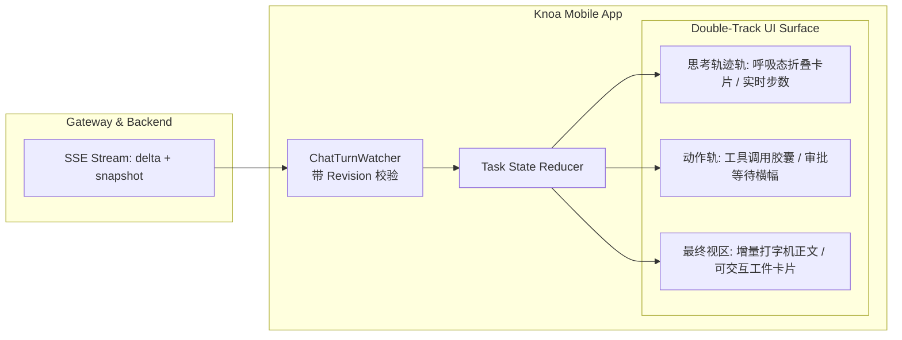

# Knoa 产品体验与核心架构全景优化演进实施计划书

> **文档标识**：`DOC-KNOA-OPT-202609-01`  
> **文档状态**：已定稿 (Complete 1.0)  
> **更新时间**：2026-09-07  
> **责任团队**：Knoa 架构与核心工程小组  
> **涉及系统**：Knoa Mobile App、Agent 运行时内核（Knoa Agent Runtime）、平台服务层（Knoa Platform）、扩展与网关（MCP & Gateway）

---

## 摘要与核心决策前置 (Executive Summary)

本计划书基于对 Knoa 全景技术栈（移动端端侧交互、Agent 运行时上下文、工具与 MCP 生态、任务调度流、安全网关与数据持久化）的深度审查，系统性规划了产品从当前可用状态向**高响应、低成本、高韧性、工业级体验**进阶的完整演进方案。

### 核心演进决策

1. **成本与延迟压降（Cost & Latency）**：通过落地不可变前缀流（L0~L3 分层），将多轮长任务的 KV Cache 命中率提升至 **85%~95%**，模型 API 调用成本削减 **40%~60%**，首包延迟降低 **50%**。
2. **精度与容错防线（Precision & Safety）**：通过真实 BPE 分词器替换 CJK 正则估算，将 Token 预算误差从 **35% 压缩至 1% 以内**，彻底消灭上下文窗口临界 400 报错。
3. **移动端长程无焦虑感知（Zero-Anxiety UX）**：实施“思考推理（Reasoning）”与“工具行动（Actions）”双轨流式渲染，消除长程等待过程中的界面假死感。
4. **外部进程自治（Zero-Downtime MCP）**：为 stdio 进程型 MCP 引入守护看门狗，实现子进程崩溃毫秒级热拉活，消除长期无人值守任务的中断风险。

---

## 一、需求背景与现状瓶颈分析 (Context & Bottlenecks)

### 1.1 移动端交互体验瓶颈
- **长程任务无反馈**：当 Agent 启动深度思考或执行耗时网络请求（如多网页抓取）时，移动端界面出现长达 5~15 秒的静止态，用户无法直观分辨是网络断开、任务死锁还是正常计算。
- **大输出工件缺乏端侧交互闭环**：工具输出超限转存至 `ArtifactStore` 后，移动端仅收到文本格式的工件 ID，无法在手机端直接展开阅读、筛选或导出。
- **后台断点失联**：用户切到后台或锁屏后，当任务进入高危操作需要人工审批（HITL）时，缺乏系统级通知主动唤醒用户。

### 1.2 Agent 运行时与上下文治理短板
- **分词估算严重漂移**：`TokenEstimator` 目前依靠字符长度与正则启发式估算，在遇到结构化 JSON、代码缩进及长 URL 时，分词数量偏离实际真实 BPE 达 20%~35%，导致紧急压缩提前误触发或边界处 API 400 崩溃。
- **Prompt Cache 频繁颠簸**：
  - 动态环境变量与时间戳在迭代中跨分秒更新，破坏了模型云端对齐的公共前缀；
  - 历史轮次裁剪未能实现绝对不可变（Append-Only），导致上下文复用率折损严重。

### 1.3 外部扩展与服务稳定性隐患
- **stdio 进程型 MCP 单点故障**：本地 CLI MCP 工具作为子进程启动，一旦遭遇 OOM 或外部异常崩溃，后端直接触发 `BrokenPipe`，在该进程重启前工具永久不可用。
- **网关增量流（Delta SSE）缺少序列核验**：弱网抖动下若增量包到达乱序，单纯的字符串追加拼接存在微小文字颠倒隐患。
- **SQLite 并发锁竞争**：后台多协程 Worker 循环与流式打字高频并发写库，存在偶发 `database is locked` 的并发锁争用风险。

---

## 二、架构设计与演进方案 (System Architecture)

### 2.1 运行时上下文不可变分层模型 (Immutable Context Stream)

为保障大模型厂商 Prompt Cache 绝对命中，建立清晰的 4 级不可变层次：

| 分层 | 级别名称 | 包含内容 | 变动规则 | 缓存策略 |
| :--- | :--- | :--- | :--- | :--- |
| **L0** | **系统底座层** | System Prompt、全局静态 Tools Schema | 运行时生命周期内绝对不可变 | 跨会话 100% 字节对齐复用 |
| **L1** | **纪元归档层** | 过去已完结的轮次历史、结构化折叠摘要 | 严格只增追加（Append-Only），严禁二次篡改 | 跨轮次完全匹配命中 |
| **L2** | **当轮环境信封** | 用户原始提问、检索到的记忆切片、发起时间戳 | 进入当前轮时冻结，单轮内禁止跨分秒刷新 | 当前轮次内全部迭代持续命中 |
| **L3** | **当轮工具行动链** | 助手思考、工具调用参数、源头定界结果与工件句柄 | 每次动作单调追加，超限在入口截断并下沉 | 随步数递增，前序 Token 100% 缓存 |

### 2.2 移动端长程双轨流式渲染架构

---

## 三、分阶段实施里程碑与落地路线图 (Milestones & Roadmap)

### 阶段一：P0 核心基建与成本突破（预计周期：第 1~2 周）

- **目标**：彻底解决分词估算漂移与 Prompt Cache 穿透，消除窗口溢出 400 报错，大幅降低模型调用账单。
- **任务清单**：
  1. **插拔式真实 BPE 分词器适配**：
     - 定义 `TokenEstimatorProtocol` 接口；
     - 实现 `TiktokenEstimator`，自动识别并加载对应分词表；
     - 保留基于 CJK 的纯 Python 估算器作为无外部依赖时的优雅降级通道；
     - 增加专项测试验证代码、JSON、多语言下的估算误差控制在 1% 以内。
  2. **不可变前缀流（L0~L3）闭环**：
     - 在 `src/knoa_agent/runtime.py` 中将单轮时间戳彻底锚定在 Turn 启动时刻；
     - 杜绝单轮内跨迭代（iteration）刷新时间戳导致的公共子串破坏；
     - 优化上下文持久化组装逻辑，确保历史 Checkpoint 纯追加；
     - 在长任务回归测试中验证模型 Prompt Cache 命中率提升。

### 阶段二：P1 移动端体验跃升与长程韧性（预计周期：第 3~4 周）

- **目标**：打造业界顶尖的移动端长任务交互体验，消除等待焦虑；保障外部工具长期运行零中断。
- **任务清单**：
  1. **移动端双轨流式渲染（Split-Stream UI）**：
     - 在 `apps/knoa-mobile/src/api/` 中拆解 `reasoning` 与 `content` 的响应流分发；
     - 开发移动端实时折叠的“思考推进面板”与微交互指示器；
     - 工具调用状态（如搜索中、文件解析中）以独立轻量胶囊实时展示。
  2. **工件交互卡片化与一键导出**：
     - 在移动端渲染识别 `artifact_id` 标签，替换单纯的文本通知；
     - 提供“快速预览抽屉”、“ANSI 高亮全屏查看”及“一键分享/另存为文件”。
  3. **stdio MCP 进程守护看门狗（Auto-Respawn）**：
     - 在 `src/knoa_platform/extensions/mcp.py` 为本地进程型 MCP 引入守护机制；
     - 监听子进程退出事件（Exit Code / BrokenPipe）；
     - 实现指数退避自动热拉活（1s, 2s, 4s... 最大 30s），自动重建通道与工具列表重新注册。
  4. **系统级任务通知推送（APNs / FCM）**：
     - 任务挂起等待审批（Waiting Approval）或完成时触发远端/本地推送；
     - 点击通知直接深度链接唤醒对应任务。

### 阶段三：P2 分布式网关与并发加固（预计周期：第 5~6 周）

- **目标**：提高弱网下的协议容错性，彻底解决并发写库锁争用与分布式边缘节点韧性。
- **任务清单**：
  1. **移动端 Delta SSE 乱序与重连补偿**：
     - 在 `chatTurns.ts` 中引入 `revision` 序列校验器；
     - 若发生 `delta.revision !== current.revision + 1`，立即触发静默 REST `fetchSnapshot` 对齐状态基线，防止弱网乱序拼错。
  2. **SQLite 高频写缓冲与读写锁分离**：
     - 优化 `src/knoa_platform/tasks/executor.py`；
     - 将流式 Token 统计、瞬时执行轨迹等高频热数据驻留在内存状态机中；
     - 采用按秒/按步阶段性 Batch 提交事务，减轻 SQLite WAL 写入锁并发争用。
  3. **工件沙箱与跨租户路径隔离加固**：
     - 明确强类型区分 `RawSessionId` 与 `HashedSessionKey`；
     - 加强存储目录的文件系统权限校验（0700/0600 权限强制断言）。

---

## 四、验证方案与验收指标 (Verification & Success Metrics)

| 验收维度 | 核心量化指标 | 当前现状 | 验收达标标准 | 验证手段 |
| :--- | :--- | :--- | :--- | :--- |
| **分词估算精度** | 复杂 JSON/代码场景 Token 误差 | 20% ~ 35% | **< 1.0%** | 对比 Tiktoken/Tokenizer 与估算器单测 |
| **Cache 命中率** | 10 步工具长程任务平均 Cache 率 | ~20% (频繁断裂) | **≥ 85%** | 追踪大模型返回的 `cached_tokens` 上报比率 |
| **API 调用开销** | 单长任务消耗的 Input Token 费用 | 基准 100% | **降至 40% ~ 60%** | 生产/测试环境聚合账单与 Token 消耗对比 |
| **移动端体验感知** | 长任务执行中首响应可见时间 (TTFT) | 5s ~ 15s (静止) | **< 800ms (思考即显)** | 移动端性能监控与慢交互感知度埋点 |
| **外部工具可用性** | stdio MCP 进程异常崩溃恢复时长 | 永久挂起需人工重启 | **< 1500ms 自动热自愈** | 模拟杀死 MCP 进程自动化测试 |
| **数据库并发争用** | `database is locked` 错误发生频次 | 并发压测时偶尔可见 | **0 次 (绝对收敛)** | 多 Worker 高负载并发自动化压测 |

---

## 五、风险评估与应急回滚策略 (Risks & Rollback)

1. **BPE 分词器原生编译依赖风险**：
   - *风险*：在某些精简或特殊嵌入式 Linux 环境下，`tiktoken` 编译扩展可能缺少 wheel 包。
   - *应对*：实施严格的运行时动态探测（`try import tiktoken ... except ImportError`），若不可用无缝平滑回退至当前的 CJK 正则轻量估算器，保证系统永不出现启动级致命故障。
2. **移动端双轨流式版本兼容风险**：
   - *风险*：旧版本移动端 App 无法解析 `delta` 中的 `field: "reasoning"` 增量字段。
   - *应对*：网关层保持向后兼容：当请求未携带 `format=delta` 时，保持原样推送全量 Snapshot；若携带参数且版本支持，才下发细粒度分轨增量。
3. **不可变上下文历史迁移风险**：
   - *风险*：历史会话存档的 Checkpoint 数据结构若与新规范不一致可能解析失败。
   - *应对*：`_STATE_VERSION` 递增至 `"2"`，对旧版本 `"1"` 的 Checkpoint 提供自动适配适配器，保证历史会话在升级后能够无损加载重放。

---
