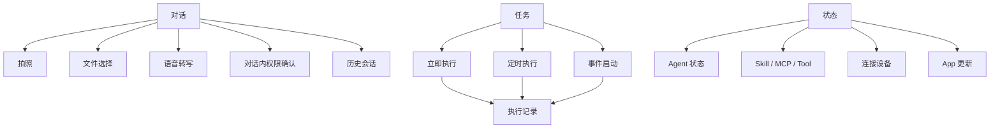
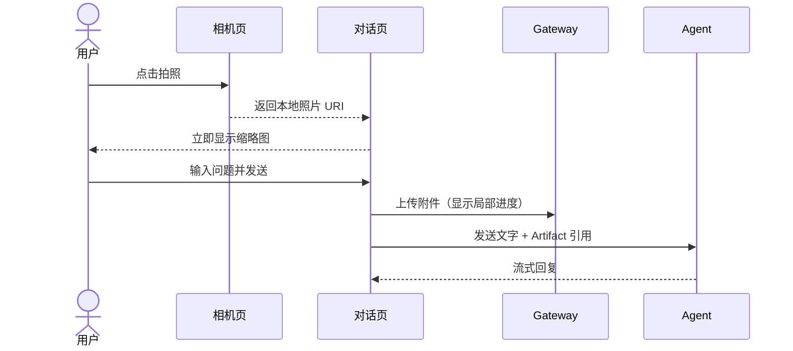

# 小诺 Mobile UI 设计

> 状态：产品线框稿，供实现与评审使用  
> 原则：聊天优先、Task 独立、内部执行模型不泄露、简洁就是美。

## 1. 信息架构



一级入口只有两个：

1. **对话**：默认首页，承载文字、照片、文件、语音和确认。
2. **任务**：管理目标、启动方式及每次执行记录。

状态、能力、设备和更新属于二级入口，不占用主导航。

## 2. 对话首页

```text
┌──────────────────────────────────┐
│  小诺                新话题  任务  状态 │
│  随时告诉我你想做什么               │
├──────────────────────────────────┤
│                                  │
│                    ┌───────────┐ │
│                    │ 你好       │ │
│                    └───────────┘ │
│                                  │
│  ┌────────────────────────────┐  │
│  │ 你好。今天想让我帮你做什么？ │  │
│  └────────────────────────────┘  │
│                                  │
│  · 正在思考…                     │
│                                  │
├──────────────────────────────────┤
│  ＋ │ 🎙 和小诺说点什么…          │发送│
└──────────────────────────────────┘
```

行为：

- 用户消息立即出现，不等待服务端完成。
- Agent 的正文按流式增量追加到同一个回复区域。
- Markdown 使用完整可用宽度，不为每个增量创建独立渲染器。
- 思考、工具调用使用灰色紧凑状态；最终正文不加“正式回复”等标签。
- Core Task/Run ID、事件序号、内部阶段默认不显示。
- 连续消息共享同一个会话上下文，可以自然追问和修正要求。
- “新话题”创建新的 App Core Session，立即获得空白对话上下文；不会
  删除旧 Session、长期记忆或仍在后台执行的自动化工作。
- App 与飞书分别维护自己的活动 Session，不共享短期对话历史。
- 输入框内的麦克风/键盘图标由用户明确切换文字或 STT 模式。
- 文字模式下右侧主按钮为“发送”；STT 模式下同一按钮为录音/停止。
- 每段转写追加到输入框后仍保持 STT 模式，可以连续录多段；用户切回
  文字模式后可以编辑并发送，系统不根据是否已有文字擅自切换模式。

## 3. 照片与文件

```text
┌──────────────────────────────────┐
│  小诺                              │
├──────────────────────────────────┤
│                                  │
│       ┌──────────────────────┐   │
│       │  [照片缩略图]     ×   │   │
│       │  camera-001.jpg      │   │
│       └──────────────────────┘   │
├──────────────────────────────────┤
│  ＋ │ 🎙 看看怎么接线             │发送│
└──────────────────────────────────┘
```

交互顺序：



- 相机页只负责拍照，不上传、不创建后台任务。
- 拍完立即回到聊天，避免用户停留在无反馈的相机界面。
- 上传状态只显示在附件附近。
- 上传失败保留原消息和附件，允许精确重试。

## 4. 对话内权限确认

```text
┌──────────────────────────────────┐
│  我需要修改系统代理配置。          │
│                                  │
│  这会影响当前电脑的网络连接。       │
│  工具：write_file                 │
│                                  │
│  ┌────────────┐  ┌────────────┐ │
│  │    取消     │  │    确认     │ │
│  └────────────┘  └────────────┘ │
└──────────────────────────────────┘
```

- 确认嵌入产生请求的 Agent 回复，不新建游离卡片。
- 同一审批只能解决一次；操作后按钮变为只读结果。
- 审批期间允许用户查看完整上下文和工具理由。
- App 重启后从标准事件流恢复待确认状态。

## 5. 任务首页

```text
┌──────────────────────────────────┐
│  任务                      返回对话 │
│  独立执行，完成后主动通知            │
├──────────────────────────────────┤
│  全部  进行中  待确认  已完成         │
│                                  │
│  ┌────────────────────────────┐  │
│  │ 审查所有仓库          运行中 │  │
│  │ 立即执行 · 第 1 次执行        │  │
│  └────────────────────────────┘  │
│                                  │
│  ┌────────────────────────────┐  │
│  │ Jira 工单发生变化       已启用 │  │
│  │ 事件启动 · 已执行 5 次        │  │
│  └────────────────────────────┘  │
│                                  │
│  ┌────────────────────────────┐  │
│  │ 每天 09:00 工作摘要     已启用 │  │
│  │ 定时执行 · 已执行 12 次       │  │
│  └────────────────────────────┘  │
└──────────────────────────────────┘
```

定义：

- **立即执行**：创建后马上产生第一条执行记录。
- **定时执行**：一次性、固定周期或 Cron 到点后产生执行记录。
- **事件启动**：Jira、GitLab、Webhook、文件变化等事件产生执行记录。
- Agent 可以在权限允许时创建 Task，但必须说明目标和启动方式。

事件启动沿用 Task 的 `launch_policy`，不增加独立的“绑定”页面。创建或编辑任务
时，用户选择 `Webhook` 或 `MCP Resource`；选择 MCP Resource 后只填写 MCP Server
标识和 Resource URI 前缀。UI 展示业务可读的来源和匹配范围，不展示内部 Trigger ID。

当 MCP Server 已连接时，Task 编辑器优先从 Resource Catalog 下拉选择 Server 和
Resource；用户仍可切换到手工 URI 输入。所有文案由 App 的 locale 字典提供，Core
只返回 `server_id`、URI、名称、描述和匹配选项等结构化字段。

Agent 可以根据用户自然语言生成同一份启动策略草稿，用户确认后保存；事件到达后由
Core 按已保存策略确定性匹配，不在每次事件到达时再次请求 Agent 判断是否触发。

普通聊天回合不进入任务列表。任务执行结果可以主动投递回来源 Channel。

CLI 和 Textual TUI 使用同一 Core API：CLI 提供 `mcp-resources`、
`task-create-event`、`task-set-event`，TUI 提供对应命令和交互式列表；它们不维护
另一套 Task 或 Trigger 状态机。

## 6. 执行详情

```text
┌──────────────────────────────────┐
│  Jira 每日汇总             进行中 │
├──────────────────────────────────┤
│  09:00  Trigger 已触发             │
│  09:00  正在读取 Jira              │
│  09:01  ✓ 获取 12 条工单           │
│  09:01  正在生成摘要                │
│                                  │
│  [暂停]                   [停止]   │
└──────────────────────────────────┘
```

- 这里才展示持久执行进度、工具摘要、产物、重试和错误。
- 默认显示人能理解的事件，不直接倾倒底层日志。
- 完成后将结果投递到指定对话，并保留后台运行记录。

## 7. 视觉规范

| 用途 | 颜色 |
|---|---|
| 页面背景 | `#F4F0E8` |
| 卡片背景 | `#FFFCF6` |
| 正文 | `#232823` |
| 思考/辅助文字 | `#747B73` |
| 主操作 | `#2F6658` |
| 主操作浅色背景 | `#DCEAE4` |
| 分割线 | `#D9D5CC` |

- 使用温和的纸张色和玉石绿，延续小诺头像的中国风气质。
- 正文优先，不使用大面积渐变、霓虹或“AI 科技蓝紫”。
- 状态图标克制；工具成功使用简单文字钩 `✓`，不使用绿色 Emoji。
- 圆角与阴影保持轻量，不让每条内容都像独立卡片。
- 正文、代码块、表格均必须占据合理宽度并支持长内容滚动。

## 8. 产品与 Core 的映射

| 用户看到的概念 | Core 实现 |
|---|---|
| 一次聊天回复 | 同一 Session 下的一次持久 Run/Task |
| 连续对话 | 共享 Session conversation |
| 权限确认 | Approval 标准事件与原子解决命令 |
| Task 启动方式 | immediate / scheduled / event policy |
| 执行记录 | 独立 Session 下的持久 TaskExecution |
| 任务结果通知 | principal 标准事件流 + Channel 展示策略 |

这个映射只存在于实现层。UI 不把每次聊天回复命名为“任务”。
