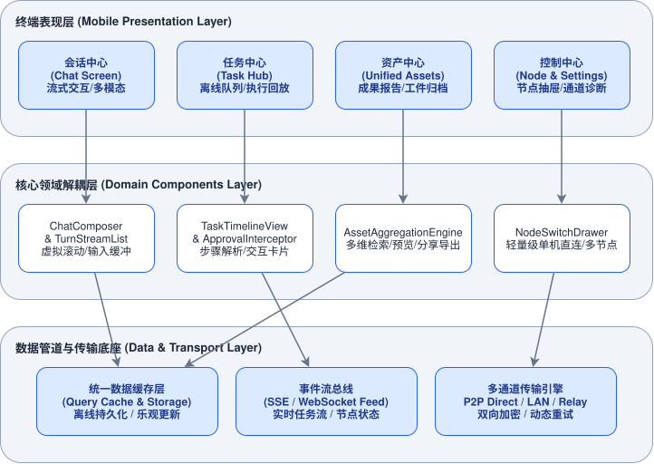
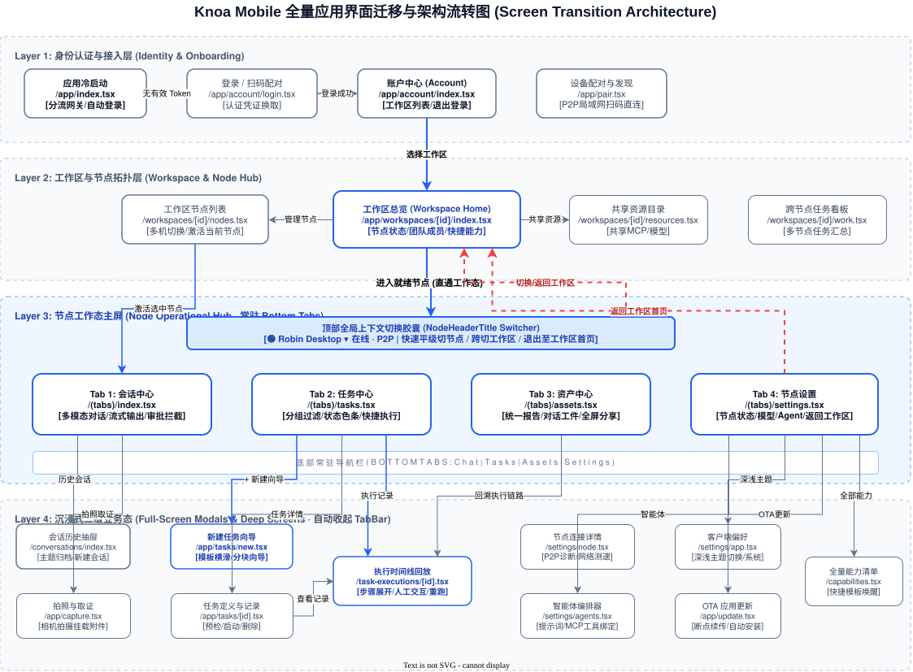
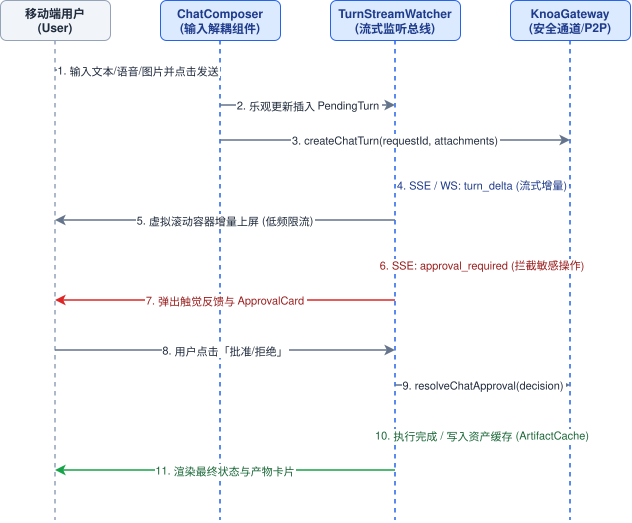

<!-- yuque: https://gaussian.yuque.com/kaccm0/ywsx5z/knoa-mobile-ux-refactor-design -->
# Knoa Mobile 体验与核心架构重构设计

> **版本**: 1.1
> **日期**: 2026-09-05
> **状态**: 方案更新深化中

---

## 1. 概述

### 1.1 文档范围
本文档针对 Knoa Mobile 客户端（`apps/knoa-mobile`）在消费级场景下的交互体验与技术架构重构进行顶层设计。涵盖全量 32 个页面路由的拓扑重组、底部导航体系引入、Chat 核心巨石组件解耦、成果与产物资产中心合并、以及数据缓存流转规范。

### 1.2 设计目标
1. **交互心智降维**：消除个人用户在单机场景下被强制暴露的 Workspace / Hosted Hub 企业级多层级负担，将打开应用的核心路径由原有的 4 层跳转压缩至直达可用。
2. **移动端标准操作**：采用符合人体工学的现代移动端底部导航栏（Bottom Tabs），消除原顶部操作栏（`HeaderActions`）在右手单手操作下的高盲区点击成本，消除侧滑切换与操作系统系统级返回手势的物理冲突。
3. **架构解耦与防劣化**：将 1500+ 行的 `app/chat.tsx` 超大型单文件按职责解耦为输入编排、流式监听、卡片拦截、虚拟滚动原子组件，杜绝频繁全量重渲染导致的滑动卡顿。
4. **资产消费聚合**：合并散落在 `results`、`artifacts`、`work` 和 `task-executions` 中的产物展示逻辑，形成一站式「资产与执行中心」。

### 1.3 术语定义
- **Node（节点）**：运行 Knoa Agent 运行时的目标实体机器（桌面电脑或边缘设备）。
- **Workspace（工作区）**：Hub 服务侧的多设备/多人协作命名空间。
- **Bottom Tabs（底部标签栏）**：应用根视口固定常驻的四大主入口导航栏。
- **Full-Screen Workspace（全屏工作态）**：进入沉浸式对话或任务详情时自动收起底部导航的二级工作路由。
- **Turn（对话回合）**：用户发起的单次提示词或多模态输入及其引发的 Agent 推理、工具调用与结果回传全周期。

---

## 2. 系统架构

### 2.1 现状架构分析
当前客户端采用基于 Expo Router 的单层 Stack 导航机制（`apps/knoa-mobile/app/_layout.tsx:40-93`），存在以下结构性缺陷：
1. **导航倒置**：核心功能切换（Chat 与 Tasks）放置在 Header 右侧（`HeaderActions.tsx:27-51`），辅助以全局左右手势（`PrimarySwipeNavigation.tsx:55-80`），与 Android/iOS 侧滑返回全局手势严重互斥。
2. **多层入口穿透**：启动分流逻辑（`app/index.tsx:77-128`）强制在 Account、Workspace、Node 三级之间做条件重定向，单机场景用户进入对话需要经历连续页面推栈。
3. **巨石文件绑定**：`app/chat.tsx` 聚合了音频录制、文件上传、流式监听、审批拦截、交互卡片和虚拟滚动算法，代码行数超过 1500 行，状态高度耦合。
4. **资产割裂**：任务成果（`results.tsx`）、会话产物（`artifacts.tsx`）、执行步骤（`task-executions/[id].tsx`）和工作区投影（`work.tsx`）四权分立，数据源分散且缓存策略不统一。

### 2.2 目标架构与全景界面迁移
重构后的整体分层架构划分为终端表现层、核心领域解耦层和数据管道与传输底座三层。同时，全量 32 个页面的交互迁移链路完整规范在分层拓扑中。



#### 全量应用界面迁移图 (Screen Transition Architecture)
系统按四层递进结构进行全景流转，彻底解决“只能在 Node 内打转、切不回 Workspace”的问题：



### 2.3 组件概要
1. **表现层（Presentation Layer）**：
   - `TabsNavigator`：承载四大核心一级页面——会话（Chat）、任务（Tasks）、资产（Assets）、控制（Settings/Node）。
   - `NodeHeaderTitle Switcher`：常驻顶部轻量级节点状态胶囊，直观展示连接与通道状态，点击提供**三向极速流转抽屉**：
     - ① 平级快速切换局域网内其他可用机器（Node）；
     - ② 跨层切换协作组织/工作区（Workspace）；
     - ③ 直退至工作区大盘概览（Workspace Home）。
   - `Full-screen Modals`：执行详情、Agent 编辑器等二级深度交互页面，进入后自动隐藏底部 TabBar。
2. **核心领域解耦层（Domain Components Layer）**：
   - `ChatComposer`：独立处理输入框膨胀、草稿防丢持久化、音频录制转录及图片预处理。
   - `TurnStreamList`：专注虚拟滚动视口管理、Token 流式字符平滑追加以及滚到底部浮动控制器。
   - `ApprovalInterceptor`：审批卡片（ChatApproval）与交互卡片（HumanInteraction）的独立状态沙箱。
   - `UnifiedAssetHub`：统合结果报告导出、图片预览与离线工件持久化。
3. **数据管道与传输底座（Data & Transport Layer）**：
   - 统一数据缓存引擎：引入基于 Key-Value 作用域绑定的自动化 Query Cache，替代各页面手工书写的 `[loading, refreshing, error]` 状态流。
   - 事件总线：将原分散在 Gateway 的事件回调抽象为中心化事件订阅机制，按 `turn_id` 和 `task_id` 分发。

---

## 3. 核心流程与场景

### 3.1 场景：日常对话与流式协同
本场景描述用户发送多模态输入、接收流式字符、并对敏感操作进行实时审批的完整时序。



**流程步骤**：
1. 用户在 `ChatComposer` 中键入文本或选取多模态文件后点击发送。
2. 表现层立即生成乐观更新记录 `PendingTurn` 并推入列表，输入框重置且草稿清空。
3. 调度网关通过当前活动通道（P2P / LAN / Relay）调用 `createChatTurn` 接口。
4. 网关返回 `turn_id`，`TurnStreamWatcher` 挂载事件监听通道。
5. 增量字符通过低频限流机制更新至滚动流容器，避免高频触发重排。
6. Agent 触发敏感工具时回传 `approval_required` 事件，系统弹出审批卡片并触发触觉反馈。
7. 用户点击批准或拒绝，调用 `resolveChatApproval` 驱动后端继续执行。
8. 执行完成后产物写入统一工件缓存并呈现最终状态。

### 3.2 场景：跨节点任务创建与执行追踪
1. **模板与策略配置**：用户进入任务中心点击新建，在移动端友好的单屏卡片中选择启动策略（立即/定时/按事件）与通知策略。
2. **预检拦截（Preflight）**：调用 `preflightTask` 校验依赖资源，若存在阻断原因（Blocked）直接原位高亮；若存在警告（Warning）则调用轻量级确认底板。
3. **执行回放与步骤展开**：在 `TaskTimelineView` 中采用可折叠步骤卡片，默认只展开当前正在执行与失败的步骤，缩短超长屏幕滚动距离。

### 3.3 场景：一站式资产检索与消费
1. 用户切换至「资产中心」（Assets Tab）。
2. 引擎联合拉取当前会话产生的生成文件与各任务的最终执行报告。
3. 提供三种直观视图：按时间维度、按关联 Agent、按文件格式（文档/图片/数据）。
4. 单项卡片提供标准移动端动作：全屏高清预览、生成 PDF 摘要报告、调用系统原生分享面板（`expo-sharing`）向微信或文件系统分发。

### 3.4 场景：全局主题自适应 (Theme Adaptation) 与多模态避让
1. **主题自适应闭环**：
   - 杜绝全局硬编码十六进制色值（如 `#000`、`#fee2e2`、`white` 等）。
   - 统一走动态语义颜色映射 `semanticColor(light, dark)`；在深色模式下，背景统一沉浸至深灰暗夜色，线条、卡片及药丸高亮均自动翻转，消除浅色白块刺眼与文字不可见问题。
2. **移动端键盘弹出与虚拟视口避让**：
   - 会话主屏及任务编辑向导必须使用 `react-native-keyboard-controller` 的 `KeyboardAvoidingView` 进行避让包裹；
   - 键盘升起时，底部操作区（输入框/发送/停止按钮）动态计算真实在屏键盘高度并向上顶起；
   - 消息列表 `FlatList` 保持自动贴底锚定（`followLatest`），输入中即时显示光标内容，保证打字视线与 Agent 最新回复完全不被遮挡。

### 3.5 异常与失败处理
为保证网络波动与节点离线时的健壮性，各环节异常处理规范如下：

| 调用或操作 | 失败行为 | 上下游影响 | 用户可见表现 |
| :--- | :--- | :--- | :--- |
| **P2P/直连网关连接失败** | 自动降级至安全中继通道（Relay），重试三次指数退避 | 不阻断正在进行的离线队列与本地缓存读取 | 顶部状态胶囊变更为“中继连接”，显示传输时延 |
| **多模态附件上传中断** | 将当前附件标记为 `failed`，保留本地文件临时引用 | 当前 Turn 保持草稿或待发状态，不发起推理 | 附件缩略图右上角展示红色重试重传图标 |
| **流式 SSE 监听断线** | 触发静默轮询回退，拉取历史增量补齐当前 Turn | 界面字符暂停输出，等待通道重建或单次轮询补齐 | 显示微小内联重连中指示条，不阻断历史查看 |
| **审批请求超时/节点失效** | 标记该 Approval 状态为过期，禁止继续提交交互 | 终止该分支执行，记录失败状态至 Timeline | 审批卡片置灰并显示“节点响应超时”提示 |
| **离线状态创建任务** | 自动转入持久化离线任务队列（OfflineTaskQueue） | 等待节点恢复连接后在后台静默刷新同步 | 任务卡片呈现“待网络恢复后自动提交”标签 |

---

## 4. 数据协议与路由规范

### 4.1 核心数据结构定义

#### 统一资产聚合实体（UnifiedAssetItem）
```typescript
interface UnifiedAssetItem {
  assetId: string;
  sourceKind: "chat_artifact" | "task_execution_result" | "exported_report";
  sourceId: string;
  nodeId: string;
  title: string;
  mimeType: string;
  byteSize: number;
  uri: string;
  previewUri?: string;
  createdAt: number;
  metadata: {
    agentId?: string;
    taskTitle?: string;
    sessionTitle?: string;
    outcomeStatus?: "success" | "partial" | "failed";
  };
}
```

#### 导航状态与上下文（NavigationScopeContext）
```typescript
interface NavigationScopeContext {
  activeTab: "chat" | "tasks" | "assets" | "settings";
  currentNodeId: string;
  currentNodeName: string;
  currentWorkspaceId: string;
  connectionMode: "p2p" | "lan" | "relay" | "offline";
}
```

### 4.2 路由与导航拓扑协议
重构后的路由目录与表现形式映射如下：

```
app/
├── (tabs)/                    # 根视口四大底部标签
│   ├── _layout.tsx            # 定义 Bottom Tabs 配置与图标
│   ├── index.tsx              # 对应 Chat 会话主屏
│   ├── tasks.tsx              # 对应任务中心主屏
│   ├── assets.tsx             # 对应统一资产中心
│   └── settings.tsx           # 对应节点管理与偏好设置
├── chat/
│   └── history.tsx            # 会话历史列表与归档抽屉
├── tasks/
│   ├── new.tsx                # 新建任务向导
│   └── [id].tsx               # 任务定义与执行记录
├── task-executions/
│   └── [id].tsx               # 执行详情与时间线
├── workspaces/                # 次级多工作区管理（深度入口）
│   └── [workspaceId]/...
├── pair.tsx                   # 扫码与快速配对
├── account/                   # 登录与账户体系
└── _layout.tsx                # 全局 Root Stack（注入弹窗与二级页）
```

### 4.3 状态管理范式
1. **禁止页面内部手动维护全套网络拉取状态**：全面收敛分散的 `loading/refreshing/cachedAt` 手动代码，由集中式缓存模块驱动。
2. **乐观更新规范**：所有聊天输入与任务状态变更必须在用户点击后 50ms 内给出界面本地态推进，网络失败后自动回滚并提供原位重试按钮。

---

## 5. 设计决策记录（ADR）

### 决策 1：采用标准底部 TabBar 替代 HeaderActions 与侧滑手势
- **背景**：原有设计通过右上角操作区与全局侧滑进行 Chat 与 Tasks 切换，导致大屏手机单手操作盲区严重，且侧滑与系统级边缘返回手势频繁冲突。
- **选项**：
  - 选项 A：继续保留顶部 HeaderActions，调整手势阈值。
  - 选项 B：改用行业标准底部 TabBar（Chat、Tasks、Assets、Settings），进入二级页面自动收起 TabBar。
- **决定**：选择选项 B。
- **后果**：大屏触控便利性显著提升，消除手势误触风险；需对 Expo Router 根布局结构进行适配改动。

### 决策 2：将 `chat.tsx` 按职责原子化拆解为领域组件群
- **背景**：`app/chat.tsx` 超过 1500 行，承担了多模态采集、流式接收、滚动锚定与卡片交互等多重职责，维护困难且易引发列表滚动卡顿。
- **选项**：
  - 选项 A：在现有单文件内进行简单函数拆分。
  - 选项 B：抽离为 `ChatComposer`、`TurnStreamList`、`ApprovalInterceptor` 等独立模块。
- **决定**：选择选项 B。
- **后果**：核心渲染树体积减小，流式输入仅重绘文本片段组件，不触发外围多余渲染；单文件代码量降至 300 行以内。

### 决策 3：合并 Results、Artifacts 与 Work 为统一资产中心
- **背景**：原有产品架构中，任务结果、对话产物和跨节点工作分别存放在三个独立界面，导致用户查找成果路径极其繁琐。
- **选项**：
  - 选项 A：维持三个页面独立，仅在界面增加跳转快捷链接。
  - 选项 B：整合建立统一「资产中心」（Unified Asset Hub），通过类型过滤器（报告/工件/文件）进行分类浏览。
- **决定**：选择选项 B。
- **后果**：降低用户认知层级，避免概念混淆；彻底废止原无配置的孤儿路由页面。

### 决策 4：跨节点任务通知严格隔离与一键全部已读机制
- **背景**：用户在多机器环境下，Tab 栏和任务中心频繁出现虚假未读提示（如常驻 9+ 角标），且进入列表后为空，原因是未按所属 Node 隔离全局 Hub 通知，且缺少一键全部已读操作。
- **选项**：
  - 选项 A：仅在客户端本地清空角标，不做数据源隔离。
  - 选项 B：对 `TaskReminder` 注入所属 `nodeId/nodeName` 元数据；Tab 角标严格按当前连接 Node 动态计算；顶部横幅明示设备来源，并在任务中心提供「一键全部已读」操作，双向同步服务端。
- **决定**：选择选项 B。
- **后果**：彻底根除跨节点未读通知干扰与虚假角标，赋予用户对消息提醒的完整掌控权。

### 决策 5：工作区大盘轻量化降维与启动直达 Agent 闭环
- **背景**：原有工作区页面充斥大量 PC 时代的目录式大卡片（文件夹整理、文档解析、健康检查等死板模板），且启动应用时经常拦截在工作区大盘，打断了用户与 Agent 的即时交互。
- **选项**：
  - 选项 A：保留静态 PC 大盘页面作为各节点的父容器。
  - 选项 B：启动与恢复逻辑全面改造为「已配对节点一律直达 `/(tabs)` 核心流」；将繁琐的工作区页面彻底重构为轻量级终端中枢（Active Terminal Hub），提供一键直达 Agent、快速终端切换列表及必要的工作区资源管理入口；将 `node.tsx`、`results.tsx`、`artifacts.tsx` 等死胡同页面收敛重定向。
- **决定**：选择选项 B。
- **后果**：消除移动端不必要的静态大盘跳板，App 打开即进入 Agent 工作流；工作区页面全面瘦身并融入多终端即时流转体系。

---

## 附录

### A. 相关文档
- 《Knoa Mobile 全页面功能审查报告》（2026-09-04）
- 《Knoa 节点与网关通信协议规范》：`docs/knoa-secure-gateway-design.md`
- 《Knoa 任务调度与协作设计》：`docs/knoa-task-product-design.md`

### B. 修订历史

| 版本 | 日期 | 修订人 | 修订描述 |
|:---|:---|:---|:---|
| 0.1 | 2026-09-04 | Robin | 初始版本：确立底部导航、组件解耦、资产聚合与状态架构设计 |
| 1.0 | 2026-09-05 | Robin | 正式定稿：完成 Phase 1 底部导航与资产整合、Phase 2 Chat 原子化拆解、Phase 3 任务向导与列表重塑、Phase 4 路由全量收敛与手势优化 |
| 1.1 | 2026-09-05 | Robin | 全局架构深化：绘制并引入全量 32 页面迁移流转图 (Layer 1~4)、强化黑白双色主题自适应与键盘避让规范、明确顶栏与设置页快速切出工作区逻辑 |
| 1.2 | 2026-09-05 | Robin | 交互与多设备治理：修复 NodeHeader 节点切换后标题不同步缺陷；实现 TaskReminder 严格按当前 Node 隔离过滤；提供任务中心一键全部已读与来源透明标注 |
| 1.3 | 2026-09-05 | Robin | 用户体验与 Agent 能力融合升级 (Phase 5)：实现对话直转任务 (Chat to Task) 管道与意图预填；ChatComposer 增加快捷任务创建与节点能力库直通；气泡新增复制与转任务轻量操作条；当前节点卡片强化能力画像直达 |
| 1.4 | 2026-09-05 | Robin | 多模态直觉感知与上下文强化 (Phase 6)：落地剪贴板智能感知浮条 (ClipboardSuggestionPill)，支持链接/报错/代码一键分析；节点抽屉支持立体能力画像动态展示可用工具数与默认模型；优化 AppMarkdown 代码块移动端高对比度排版 |
| 1.5 | 2026-09-05 | Robin | 极速人机审批干预 (Actionable HITL Banner)：顶部任务通知横幅全面支持内联快捷审批 (Approve/Reject)，实现跨页面 0 跳转秒级安全拦截与决策闭环 |
| 2.0 | 2026-09-05 | Robin | 极速瘦身与工作区架构重塑 (Phase 7)：实现 App 启动一律直达 `/(tabs)`；彻底重构繁琐的 Workspace 页面，剔除 PC 静态大卡片，重塑为多终端轻量中枢；收敛废弃 `node.tsx`/`results.tsx`/`artifacts.tsx` 冗余死胡同页面 |
| 2.1 | 2026-09-05 | Robin | 生产力飞跃 (Phase 8)：实现 Chat 输入框 Slash 快捷指令面板（/task, /summary, /status, /clean, /clear）；任务向导落地自然语言一句话建任务解析器（Smart NL Task Parsing） |
| 2.2 | 2026-09-05 | Robin | 检索与资产闭环 (Phase 9)：资产中心全面接入全文即时搜索与智能分栏统计，支持任务成果与会话产物双向联查与一键导出 |
