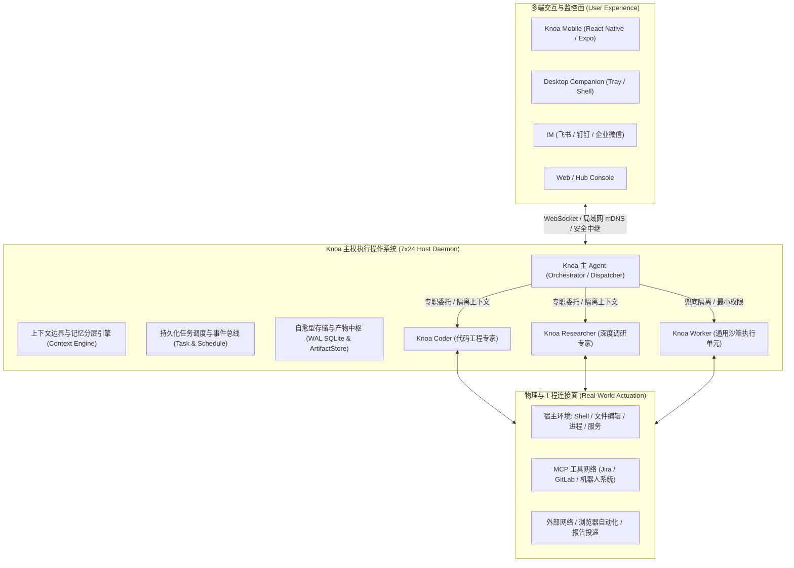

# Knoa 产品本质审视与 Jira 工程分析能力进阶

> **版本**: 1.0  
> **日期**: 2026-09-08  
> **状态**: 已定稿  

---

## 1. 概述

### 1.1 背景与目标
随着大模型 Agent 技术的快速迭代，业界充斥着大量以“对话框套壳”、“单体 Prompt 堆砌工具”为主的玩具型应用。这些应用普遍存在长时运行崩溃、上下文无限膨胀、单次请求 Token 成本失控、以及无法真正穿透本地物理与工程环境等致命问题。

本文件旨在完成两大核心使命：
1. **产品本质与核心价值审视**：彻底厘清 Knoa 究竟是什么、它如何真正为用户创造高杠杆价值、以及它与传统 Chatbot / Agent 的本质代差。
2. **Jira MCP 与工业级缺陷诊断能力演进**：结合实际工程中成熟的全局 Jira 分析体系（`oss://` 匿名存储解析、Tempo 机器人日志/Bag 提取、机器 SN 缺陷聚类分析、领域业务信号提取），给出将通用 Jira MCP 升级为“工业级缺陷智能分析闭环”的完整架构方案。

---

## 2. Knoa 产品本质审视：我们究竟是什么？

### 2.1 Knoa 绝不是什么（反向定义）
- **不是网页套壳 Chatbot**：不是给 Claude 或 ChatGPT 简单包一个 Web 界面；页面关闭，一切终止。
- **不是单体巨石 Prompt 运行时**：不是把 50 个工具直接塞给一个万能 Prompt，让它在同一个对话上下文里从头猜到尾，导致单轮消耗数万 Token 且执行频频翻车。
- **不是虚幻的云端 SaaS 玩具**：不要求用户把企业代码库、本地私有日志和高权限凭证拱手上传到第三方云端服务。

### 2.2 Knoa 的核心定义
> **Knoa 是一款面向个人与工程师的“主权常驻型虚拟数字员工与执行操作系统”（Sovereign Personal AI OS & Autonomous Co-Worker）。**

用户只需要描述意图与期望达成的目标，Knoa 负责自主理解、安全预检、任务分解、调度专职 Agent、调用本地与网络工具执行、在关键风险点请求人类确认、保存不可变证据，并在用户离线时**7×24 小时不间断运行、自愈并跨端同步结果**。



---

## 3. Knoa 如何给用户提供无可替代的价值？

### 3.1 价值一：从“同步实时问答”升维到“异步目标委托”
- **传统方式**：用户守在屏幕前，打一段字，等模型吐字，发现格式不对再纠偏，耗费大量脑力与时间。
- **Knoa 价值**：
  - 用户说：“每天早上 9 点帮我生成一份包含国内要闻与前沿科技的晨报并弹窗提醒”；
  - 用户说：“帮我巡检 Jira 综测缺陷，把分配给我的工单关联的现场机器人 Log 下载并排查是否有崩溃栈，整理出初步根因”；
  - 用户交代完即可离开，Knoa 在后台以小时为周期异步推进、重试恢复、自愈网络波动，并在完成时通过手机推送最终交付物。

### 3.2 价值二：组织化架构击碎“Token 成本与上下文污染”
- **工程痛点**：单 Agent 处理复杂任务（如一边阅读 100 篇网页，一边修改 5 个代码文件）会导致对话历史急剧膨胀，单次交互 Token 突破十万，既慢又贵，且极易产生注意力分散与幻觉。
- **Knoa 价值**：
  - 遵循 **“Direct First, Specialist When Proven, General Worker as Isolation Fallback”** 原则；
  - 主 Agent 仅维持精简上下文与编排计划，重型探索完全委托给专职 Agent（如 `researcher` 跑 30 步网页检索后只带回 500 字提炼精华；`coder` 在独立会话读写代码测试后只返回根因补丁证据）；
  - 主会话永远纯净高效，Token 消耗降低 70%~90%。

### 3.3 价值三：工业级可信性与长周期免维护自愈
- **真实生产环境运行验证**：
  - **存储自愈**：SQLite 数据库引入分级截断与自动 WAL 检查点，超时任务轨迹与大字段自动压缩清理，空闲页高效复用；
  - **产物全生命周期**：区分 `borrowed`（借用用户文件绝不冗余拷贝和误删）、`temporary`（1小时 TTL 自动物理回收）、`persistent`（持久归档），彻底避免磁盘无限膨胀；
  - **安装包与日志自动淘汰**：移动端历史安装包保留最新 3 代（释放 2.6GB+ 空间），Windows 服务更新脚本滚动保留，无需人工删日志打补丁。

---

## 4. 全局 Jira 分析 Skill 深度调研与能力对比

当前开发机全局环境下，存在一套成熟且经历过工业实践检验的 Jira 分析技能（`~/.agents/skills/jira/`），其能力远超传统的通用 Jira 工具，具有极高的借鉴与整合价值。

### 4.1 全局 Jira Skill 的核心优势
1. **中文业务字段动态映射**：
   - 传统 MCP 只能输出 `customfield_11118` 等随机哈希字段名，模型无法理解；
   - 该 Skill 会自动缓存并双向映射为 `"机器SN"`、`"客户名称"`、`"归属产品"`、`"发生时间"` 等直观中文键。
2. **打通机器人/工业日志大文件下载链路（破局点）**：
   - 现场机器人发生故障时，几百 MB 到数 GB 的 ROS 日志、Bag 包和音频文件**不可能直接挂在 Jira 附件中**；
   - 实际工单是通过 `oss://gs-public-shared/...` 匿名公网链接，或者 Tempo 云平台分享链接 `shared-record-list/...` 进行传递；
   - 该 Skill 内置了免鉴权直接拉取阿里云 OSS 的客户端（`oss_client.py`），以及集成机器人统一云认证、按机器所在大区（中国/欧洲/北美）动态路由终端节点的 Tempo 客户端（`tempo_client.py`），使 Agent 能直接下载原始运行日志！
3. **同设备硬件缺陷关联分析（`--sn-relate`）**：
   - 提取工单中的机器 SN，自动聚合该机器的历史同类工单，帮助研发一眼识别究竟是“单机偶发硬件老化”还是“共性软件缺陷”。
4. **业务信号与领域识别引擎（`assess_issue.py`）**：
   - 基于规则与正则自动提炼核心信号：是否涉及电梯联动（梯控）、是否属于运动规划避障（PNC）、是否缺失关键日志、是否需要总部二线研发介入。
5. **结构化质量分析输出模板**：
   - 强制采用工业级闭环规范：`*1/4问题描述*`、`*2/4原因分析*`、`*3/4改善措施*`，并自动转换为 Jira Wiki Markup 格式。

### 4.2 现状能力鸿沟（Gap Analysis）

| 维度 | Knoa 现有 Jira MCP (`examples/jira_mcp_server`) | 全局 Jira 分析 Skill (`~/.agents/skills/jira`) | 演进目标（Knoa Jira 进阶方案） |
|---|---|---|---|
| **协议标准** | 标准 MCP（stdio / JSON-RPC），具备资源订阅模型 | Python 独立 CLI 脚本（标准输出 JSON） | 保持标准 MCP 规范，封装底层能力 |
| **自定义字段** | 仅支持原始 `customfield_xxx` 字段 | 自动拉取元数据映射为中文人类可读键 | **MCP 原生支持字段元数据翻译** |
| **大文件日志链** | 仅支持 Jira 本地附件下载（无法下载现场日志） | 原生支持 `oss-cp`、`tempo-cp` 下载 Bag/Log | **MCP 集成 OSS 与 Tempo 工业日志下载器** |
| **硬件同频关联** | 无 | 支持 `--sn-relate` 聚合同机器历史故障 | **新增 `jira.find_related_by_sn` 工具** |
| **缺陷诊断闭环** | 仅停留在工单字段读写 | 具备信号提炼，但无法全自动解包诊断代码 | **联动 Coder / Worker 完成本地日志解包排查** |

---

## 5. Jira MCP 与 Agent 能力进阶架构设计

### 5.1 进阶架构全景

```mermaid
flowchart TD
    User([用户发起委托: "排查 SELLSERVIC-12345 缺陷根因"]) --> KnoaDispatcher[Knoa 主 Agent / 调度器]
    
    subgraph DefectWorkflow["缺陷诊断专属流水线 (Defect Analysis Pipeline)"]
        KnoaDispatcher -->|委派任务 + 隔离上下文| DefectAgent[Knoa Defect Specialist / Worker]
        
        subgraph JiraMCPEnhanced["增强型 Jira MCP Server"]
            ToolIssue["jira.get_issue (含中文字段映射 & 信号提炼)"]
            ToolOSS["jira.download_oss_evidence (零依赖 OSS 下载)"]
            ToolTempo["jira.download_tempo_records (Tempo 云日志直连)"]
            ToolSN["jira.correlate_by_sn (同机器历史故障聚类)"]
            ToolComment["jira.add_quality_comment (标准三段式确认回写)"]
        end

        DefectAgent -->|1. 获取工单与外部日志链接| ToolIssue
        DefectAgent -->|2. 聚合同设备历史故障| ToolSN
        DefectAgent -->|3. 下载现场 Log / Bag| ToolOSS & ToolTempo
        
        subgraph LocalDiagnostics["本地诊断与源码定位 (Host Actuation)"]
            ExtractLog["解包日志 / 归档 (tar / zip / zstd)"]
            GrepErrors["grep_search / 正则提取 Fatal / Crash 栈"]
            CodeInspection["read_file / inspect_code 定位出错行"]
        end

        ToolOSS & ToolTempo -->|下载至 evidence 目录| ExtractLog
        ExtractLog --> GrepErrors --> CodeInspection
        CodeInspection --> DefectAgent
    end

    DefectAgent -->|4. 提炼根因与补丁建议| KnoaDispatcher
    KnoaDispatcher --> UserReview{用户审查 & 审批确认}
    UserReview -->|批准| ToolComment
    UserReview -->|修改后批准| ToolComment
```

### 5.2 增强型 Jira MCP 工具集详细规划

1. **`jira.get_issue` 升级**：
   - 自动包含动态字段映射，输出中文属性字典（如 `"客户名称"`、`"机器SN"`、`"归属产品"`）；
   - 自动识别并提取内容中的外部凭据：解析出 `oss_links: ["oss://gs-public-shared/..."]` 与 `shared_record_links: [".../shared-record-list/..."]`；
   - 自动提取业务特征标签（梯控、PNC、二线流转、数据缺失）。
2. **`jira.download_oss_evidence`（新增）**：
   - **输入**：`issue_key`, `oss_url`（如 `oss://gs-public-shared/defect_logs/2026/09/xxx.log.tar.gz`）；
   - **行为**：利用公共读快速下载通道，直接以流式写入当前工单的 `evidence/` 目录，计算 SHA-256 并返回本地路径。
3. **`jira.download_tempo_records`（新增）**：
   - **输入**：`issue_key`, `record_ids`, 可选 `share_id`；
   - **行为**：调用机器人云端开放 API，拉取状态为 `AVAILABLE` 的 Bag/Log 原始记录，写入本地工作区。
4. **`jira.correlate_by_sn`（新增）**：
   - **输入**：`serial_number`, `limit`；
   - **行为**：执行 JQL `cf[机器SN] ~ "SN" ORDER BY created DESC`，返回同设备历史工单列表与解决状态，识别惯发故障。
5. **`jira.add_quality_comment`（升级写工具）**：
   - 强制格式规范化校验（1/4 现象，2/4 根因，3/4 措施），自动添加 AI 标识与 Wiki 标记语法，并纳入高风险确认阻断。

### 5.3 联动 Agent 的本地自动化诊断闭环
当增强型 Jira MCP 提供完整的外部证据后，Knoa 的多 Agent 架构优势将彻底释放：
- **第一阶段（数据就绪）**：Jira MCP 将远程分散在云端、机器端的工单元数据、图片和几百 MB 日志收集到受控目录；
- **第二阶段（本地算力闭环）**：Agent 在本地调用 `run_command`（解包）、`grep_search`（正则搜索段错误、`FATAL`、`Exception`）、`read_file`（比对本地代码库相关行）；
- **第三阶段（高可信输出）**：不靠虚无的想象，而是基于真实的日志堆栈、代码行号和同机器历史记录，生成具备极高可信度的技术排查报告。

---

## 6. 演进路线与实施计划

1. **第一阶段：文档与定位定稿（当前）**
   - 明确 Knoa 长期常驻虚拟员工的核心定位；
   - 产出产品价值审视与 Jira 演进设计方案。
2. **第二阶段：Jira MCP 核心能力补齐（基础层）**
   - 将 `oss_client` 与 `tempo_client` 的核心下载机制移植到 `examples/jira_mcp_server`；
   - 在 MCP 中集成 Jira 自定义字段元数据缓存与中文映射器；
   - 补充单元测试（模拟 OSS 与 Jira REST 响应）。
3. **第三阶段：Agent 专业流水线打通（应用层）**
   - 在主 Agent 编排指令中注册“Jira 缺陷诊断”标准工作流；
   - 支持从移动端或 IM 一键派发工单分析任务，实现“输入工单号 -> 自动下日志 -> 自动排查代码 -> 输出三段式根因结论”的全自动闭环。
