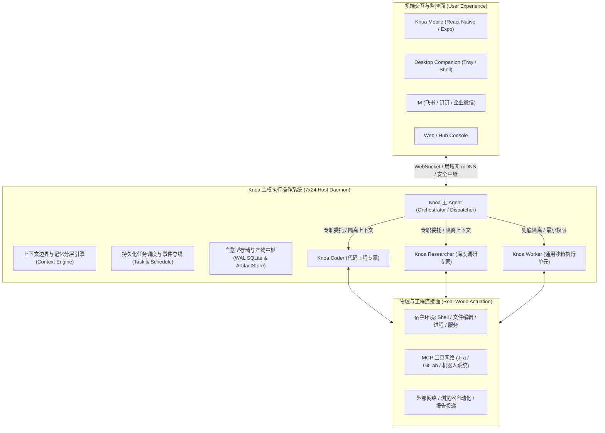
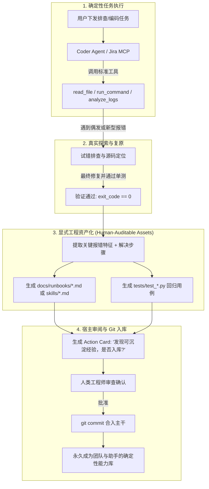

# Knoa 产品本质审视与 Jira 工程分析能力进阶

> **版本**: 1.0  
> **日期**: 2026-09-08  
> **状态**: 已定稿  

---

## 1. 概述

### 1.1 背景与目标
随着大模型 Agent 技术的快速迭代，业界充斥着大量以“对话框套壳”、“单体 Prompt 堆砌工具”为主的玩具型应用。这些应用普遍存在长时运行崩溃、上下文无限膨胀、单次请求 Token 成本失控、以及无法真正穿透本地物理与工程环境等致命问题。

本文件旨在完成两大核心使命：
1. **产品本质与核心价值审视**：彻底厘清 Knoa 究竟是什么、它如何真正为用户创造高杠杆价值、以及它与传统 Chatbot / Agent 的本质代差。
2. **Jira MCP 与工业级缺陷诊断能力演进**：结合实际工程中成熟的全局 Jira 分析体系（`oss://` 匿名存储解析、Tempo 机器人日志/Bag 提取、机器 SN 缺陷聚类分析、领域业务信号提取），给出将通用 Jira MCP 升级为“工业级缺陷智能分析闭环”的完整架构方案。

---

## 2. Knoa 产品本质审视：我们究竟是什么？

### 2.1 Knoa 绝不是什么（反向定义）
- **不是网页套壳 Chatbot**：不是给 Claude 或 ChatGPT 简单包一个 Web 界面；页面关闭，一切终止。
- **不是单体巨石 Prompt 运行时**：不是把 50 个工具直接塞给一个万能 Prompt，让它在同一个对话上下文里从头猜到尾，导致单轮消耗数万 Token 且执行频频翻车。
- **不是虚幻的云端 SaaS 玩具**：不要求用户把企业代码库、本地私有日志和高权限凭证拱手上传到第三方云端服务。

### 2.2 Knoa 的核心定义
> **Knoa 是一款面向个人与工程师的“主权常驻型虚拟数字员工与执行操作系统”（Sovereign Personal AI OS & Autonomous Co-Worker）。**

用户只需要描述意图与期望达成的目标，Knoa 负责自主理解、安全预检、任务分解、调度专职 Agent、调用本地与网络工具执行、在关键风险点请求人类确认、保存不可变证据，并在用户离线时**7×24 小时不间断运行、自愈并跨端同步结果**。



---

## 3. Knoa 如何给用户提供无可替代的价值？

### 3.1 价值一：从“同步实时问答”升维到“异步目标委托”
- **传统方式**：用户守在屏幕前，打一段字，等模型吐字，发现格式不对再纠偏，耗费大量脑力与时间。
- **Knoa 价值**：
  - 用户说：“每天早上 9 点帮我生成一份包含国内要闻与前沿科技的晨报并弹窗提醒”；
  - 用户说：“帮我巡检 Jira 综测缺陷，把分配给我的工单关联的现场机器人 Log 下载并排查是否有崩溃栈，整理出初步根因”；
  - 用户交代完即可离开，Knoa 在后台以小时为周期异步推进、重试恢复、自愈网络波动，并在完成时通过手机推送最终交付物。

### 3.2 价值二：组织化架构击碎“Token 成本与上下文污染”
- **工程痛点**：单 Agent 处理复杂任务（如一边阅读 100 篇网页，一边修改 5 个代码文件）会导致对话历史急剧膨胀，单次交互 Token 突破十万，既慢又贵，且极易产生注意力分散与幻觉。
- **Knoa 价值**：
  - 遵循 **“Direct First, Specialist When Proven, General Worker as Isolation Fallback”** 原则；
  - 主 Agent 仅维持精简上下文与编排计划，重型探索完全委托给专职 Agent（如 `researcher` 跑 30 步网页检索后只带回 500 字提炼精华；`coder` 在独立会话读写代码测试后只返回根因补丁证据）；
  - 主会话永远纯净高效，Token 消耗降低 70%~90%。

### 3.3 价值三：工业级可信性与长周期免维护自愈
- **真实生产环境运行验证**：
  - **存储自愈**：SQLite 数据库引入分级截断与自动 WAL 检查点，超时任务轨迹与大字段自动压缩清理，空闲页高效复用；
  - **产物全生命周期**：区分 `borrowed`（借用用户文件绝不冗余拷贝和误删）、`temporary`（1小时 TTL 自动物理回收）、`persistent`（持久归档），彻底避免磁盘无限膨胀；
  - **安装包与日志自动淘汰**：移动端历史安装包保留最新 3 代（释放 2.6GB+ 空间），Windows 服务更新脚本滚动保留，无需人工删日志打补丁。

---

## 4. 全局 Jira 分析 Skill 深度调研与能力对比

当前开发机全局环境下，存在一套成熟且经历过工业实践检验的 Jira 分析技能（`~/.agents/skills/jira/`），其能力远超传统的通用 Jira 工具，具有极高的借鉴与整合价值。

### 4.1 全局 Jira Skill 的核心优势
1. **中文业务字段动态映射**：
   - 传统 MCP 只能输出 `customfield_11118` 等随机哈希字段名，模型无法理解；
   - 该 Skill 会自动缓存并双向映射为 `"机器SN"`、`"客户名称"`、`"归属产品"`、`"发生时间"` 等直观中文键。
2. **打通机器人/工业日志大文件下载链路（破局点）**：
   - 现场机器人发生故障时，几百 MB 到数 GB 的 ROS 日志、Bag 包和音频文件**不可能直接挂在 Jira 附件中**；
   - 实际工单是通过 `oss://gs-public-shared/...` 匿名公网链接，或者 Tempo 云平台分享链接 `shared-record-list/...` 进行传递；
   - 该 Skill 内置了免鉴权直接拉取阿里云 OSS 的客户端（`oss_client.py`），以及集成机器人统一云认证、按机器所在大区（中国/欧洲/北美）动态路由终端节点的 Tempo 客户端（`tempo_client.py`），使 Agent 能直接下载原始运行日志！
3. **同设备硬件缺陷关联分析（`--sn-relate`）**：
   - 提取工单中的机器 SN，自动聚合该机器的历史同类工单，帮助研发一眼识别究竟是“单机偶发硬件老化”还是“共性软件缺陷”。
4. **业务信号与领域识别引擎（`assess_issue.py`）**：
   - 基于规则与正则自动提炼核心信号：是否涉及电梯联动（梯控）、是否属于运动规划避障（PNC）、是否缺失关键日志、是否需要总部二线研发介入。
5. **结构化质量分析输出模板**：
   - 强制采用工业级闭环规范：`*1/4问题描述*`、`*2/4原因分析*`、`*3/4改善措施*`，并自动转换为 Jira Wiki Markup 格式。

### 4.2 现状能力鸿沟（Gap Analysis）

| 维度 | Knoa 现有 Jira MCP (`examples/jira_mcp_server`) | 全局 Jira 分析 Skill (`~/.agents/skills/jira`) | 演进目标（Knoa Jira 进阶方案） |
|---|---|---|---|
| **协议标准** | 标准 MCP（stdio / JSON-RPC），具备资源订阅模型 | Python 独立 CLI 脚本（标准输出 JSON） | 保持标准 MCP 规范，封装底层能力 |
| **自定义字段** | 仅支持原始 `customfield_xxx` 字段 | 自动拉取元数据映射为中文人类可读键 | **MCP 原生支持字段元数据翻译** |
| **大文件日志链** | 仅支持 Jira 本地附件下载（无法下载现场日志） | 原生支持 `oss-cp`、`tempo-cp` 下载 Bag/Log | **MCP 集成 OSS 与 Tempo 工业日志下载器** |
| **硬件同频关联** | 无 | 支持 `--sn-relate` 聚合同机器历史故障 | **新增 `jira.find_related_by_sn` 工具** |
| **缺陷诊断闭环** | 仅停留在工单字段读写 | 具备信号提炼，但无法全自动解包诊断代码 | **联动 Coder / Worker 完成本地日志解包排查** |

---

## 5. Jira MCP 与 Agent 能力进阶架构设计

### 5.1 进阶架构全景

```mermaid
flowchart TD
    User([用户发起委托: "排查 SELLSERVIC-12345 缺陷根因"]) --> KnoaDispatcher[Knoa 主 Agent / 调度器]
    
    subgraph DefectWorkflow["缺陷诊断专属流水线 (Defect Analysis Pipeline)"]
        KnoaDispatcher -->|委派任务 + 隔离上下文| DefectAgent[Knoa Defect Specialist / Worker]
        
        subgraph JiraMCPEnhanced["增强型 Jira MCP Server"]
            ToolIssue["jira.get_issue (含中文字段映射 & 信号提炼)"]
            ToolOSS["jira.download_oss_evidence (零依赖 OSS 下载)"]
            ToolTempo["jira.download_tempo_records (Tempo 云日志直连)"]
            ToolSN["jira.correlate_by_sn (同机器历史故障聚类)"]
            ToolComment["jira.add_quality_comment (标准三段式确认回写)"]
        end

        DefectAgent -->|1. 获取工单与外部日志链接| ToolIssue
        DefectAgent -->|2. 聚合同设备历史故障| ToolSN
        DefectAgent -->|3. 下载现场 Log / Bag| ToolOSS & ToolTempo
        
        subgraph LocalDiagnostics["本地诊断与源码定位 (Host Actuation)"]
            ExtractLog["解包日志 / 归档 (tar / zip / zstd)"]
            GrepErrors["grep_search / 正则提取 Fatal / Crash 栈"]
            CodeInspection["read_file / inspect_code 定位出错行"]
        end

        ToolOSS & ToolTempo -->|下载至 evidence 目录| ExtractLog
        ExtractLog --> GrepErrors --> CodeInspection
        CodeInspection --> DefectAgent
    end

    DefectAgent -->|4. 提炼根因与补丁建议| KnoaDispatcher
    KnoaDispatcher --> UserReview{用户审查 & 审批确认}
    UserReview -->|批准| ToolComment
    UserReview -->|修改后批准| ToolComment
```

### 5.2 增强型 Jira MCP 工具集详细规划

1. **`jira.get_issue` 升级**：
   - 自动包含动态字段映射，输出中文属性字典（如 `"客户名称"`、`"机器SN"`、`"归属产品"`）；
   - 自动识别并提取内容中的外部凭据：解析出 `oss_links: ["oss://gs-public-shared/..."]` 与 `shared_record_links: [".../shared-record-list/..."]`；
   - 自动提取业务特征标签（梯控、PNC、二线流转、数据缺失）。
2. **`jira.download_oss_evidence`（新增）**：
   - **输入**：`issue_key`, `oss_url`（如 `oss://gs-public-shared/defect_logs/2026/09/xxx.log.tar.gz`）；
   - **行为**：利用公共读快速下载通道，直接以流式写入当前工单的 `evidence/` 目录，计算 SHA-256 并返回本地路径。
3. **`jira.download_tempo_records`（新增）**：
   - **输入**：`issue_key`, `record_ids`, 可选 `share_id`；
   - **行为**：调用机器人云端开放 API，拉取状态为 `AVAILABLE` 的 Bag/Log 原始记录，写入本地工作区。
4. **`jira.correlate_by_sn`（新增）**：
   - **输入**：`serial_number`, `limit`；
   - **行为**：执行 JQL `cf[机器SN] ~ "SN" ORDER BY created DESC`，返回同设备历史工单列表与解决状态，识别惯发故障。
5. **`jira.add_quality_comment`（升级写工具）**：
   - 强制格式规范化校验（1/4 现象，2/4 根因，3/4 措施），自动添加 AI 标识与 Wiki 标记语法，并纳入高风险确认阻断。

### 5.3 联动 Agent 的本地自动化诊断闭环
当增强型 Jira MCP 提供完整的外部证据后，Knoa 的多 Agent 架构优势将彻底释放：
- **第一阶段（数据就绪）**：Jira MCP 将远程分散在云端、机器端的工单元数据、图片和几百 MB 日志收集到受控目录；
- **第二阶段（本地算力闭环）**：Agent 在本地调用 `run_command`（解包）、`grep_search`（正则搜索段错误、`FATAL`、`Exception`）、`read_file`（比对本地代码库相关行）；
- **第三阶段（高可信输出）**：不靠虚无的想象，而是基于真实的日志堆栈、代码行号和同机器历史记录，生成具备极高可信度的技术排查报告。

---

## 6. Knoa 核心设计哲学与 L3 务实演进原则 (First Principles & Pragmatic Evolution)

### 6.1 反思学术泡沫：为什么学术界“自进化”在工业落地中往往失败？
近年来学术界提出了诸多“自进化 Agent”框架（如微软 EvoTest、AutoGen 多层进化架构等），在特定合成评测基准（如 Jericho 文本游戏、闭卷题库）上跑出了亮眼指标，但在工业界实际落地的反响却非常冷淡，核心原因在于其犯了**“为了实现而实现、为了论文而增加复杂性”**的典型错误：

1. **不可控的黑盒突变严重破坏工程信任**：
   - 工业界软件工程的第一铁律是**可预测性（Predictability）**与**确定性（Determinism）**。
   - 如果一个 Agent 在后台不断擅自修改自身的 Prompt、参数和行为逻辑，今天能稳定跑通的流水线，明天可能因为一次糟糕的“自反思”而彻底瘫痪。一旦出错，研发团队甚至无法复现和定位根因。
2. **多层嵌套导致复杂度雪崩与成本失控**：
   - 为了实现“Actor 执行 -> Evolver 复盘 -> Optimizer 调参”的理论闭环，引入了极其臃肿的多 Agent 嵌套与漫长的循环。不仅导致单次任务响应延迟暴增数倍、Token 账单成倍飙升，而且每一层 Agent 的幻觉和噪声都在级联放大。
3. **脱离实际生产场景的“玩具游戏”**：
   - 学术论文常假设有一个定义极度清晰的模拟器（Game Simulator）可以无限制重跑。而在现实复杂的工业环境（ROS 现场日志、CMake/C++ 依赖链、Jira 工单流转、现场网络抖动）中，根本不存在廉价无限回放的沙盒，盲目套用学术模型只会带来灾难。

---

### 6.2 Knoa 的第一性设计原则 (First Principles of Knoa)
Knoa 不追求学术概念包装，其一切架构必须牢牢钉在以下四大第一性原则之上：

#### 原则一：实用主义至上，拒绝为了 Agent 而 Agent (Pragmatism over Complexity)
- **极简工程路径**：能用一行 Shell、一个精准正则表达式、或一个确定性单元测试解决的问题，**绝不引入多轮大模型反思**。
- **纯净核心边界**：Knoa 核心平台保持通用与极简，所有具体业务逻辑（如 Jira 缺陷排查、机器人云端下载、工业日志解包）**严格外置为独立的标准 MCP 插件**，绝不污染平台内核。

#### 原则二：透明可审计的工程资产，拒绝黑盒状态自变异 (Auditable Assets over Black-Box Mutation)
- 资深工程师团队是如何“进化”的？不是靠工程师大脑发生不可逆的变异，而是靠**沉淀可被人类阅读、评审、合入 Git 仓库的工程资产**：
  - 遇到未知 Bug 调试成功后，沉淀为一份结构化的 **Markdown 故障排查手册（Runbook）**；
  - 编写一个能够复现并阻断该 Bug 再次发生的 **自动化单元测试用例（Regression Test）**；
  - 将通用的分析流程固化为一个带类型签名的 **标准 MCP 工具函数**。
- Knoa 的“演进”必须完全对齐这一工程常识：任何经验积累必须具象化为**人类可看懂、可审阅、带版本控制的文件资产**，绝不搞神神秘秘的底层权重自修改。

#### 原则三：人类主权与不可逾越的安全红线 (Human Sovereignty & Staged Actions)
- Knoa 定位为工业研发的**“高可靠副手（Reliable Co-worker）”**，而不是脱缰的黑盒决策者。
- 凡是涉及修改代码、写入数据库、流转 Jira 工单状态、或向生产环境推流等任何有外部副作用的行为，**必须采用“物料化草稿（Staged Action Cards）”**：
  - 助手负责穷尽脏活累活（下载几百 MB 日志、解包定位段错误行、生成 Patch Diff 和三段式根因草稿）；
  - 决策权永远在人类手中：在移动端或聊天界面，用户仅需扫一眼 Diff，点按“批准”，再由系统确定性执行。

#### 原则四：零维护、长周期稳定运行的确定性 (Zero-Maintenance Determinism)
- 既然是 7×24h 常驻的专属数字员工，系统就必须具备 UNIX 守护进程级别的可靠度：
  - SQLite WAL 超过阈值自动截断、日志轮转自动 Gzip 压缩、历史多余 APK 自动物理淘汰；
  - 外部服务偶发不可达时，采用指数退避与确定性重试，而不是无休止盲目瞎猜。

---

### 6.3 务实可落地的经验沉淀闭环架构 (Actionable Asset Pipeline)

摒弃不可靠的“Prompt 自我突变”，Knoa 采用**“显式资产沉淀流水线”**：



#### 典型落地场景示例：
- **场景**：在 Python 3.10 环境下执行测试，偶发 `ImportError: cannot import name 'UTC' from 'datetime'`。
- **学术界做法**：让模型生成自然语言反思存入向量数据库，下次由于上下文过长再次遗忘，或者改乱了自身的 Prompt。
- **Knoa 务实做法**：
  1. 排查修复后，生成一个标准的回归测试用例合入 `tests/test_automation_recurrence.py`；
  2. 生成一条简明的技术规约（如存入 `.cursor/rules/` 或项目规范文档）：`"在 Python 3.10 环境中统一采用 from datetime import timezone; UTC = timezone.utc"`；
  3. 人类通过 Git Commit 进行代码审阅并合入；
  4. 下次任何 Agent 或人类开发者在写代码时，直接遵循仓库内的明确规则与单测保护，**零幻觉、零漂移、100% 确定性**。

---

### 6.4 协同辅助支柱：主动感知早报与物料化决策
在坚持实用主义与人类主权的前提下，落地两项最能切中日常研发痛点的核心功能：
- **主动晨间早报 (Proactive Morning Standup)**：7×24h 守护进程在清晨低峰期通过轻量探针巡检 Git PR、Jira 工单增量与磁盘状态，合成结构化简报推送给移动端；
- **物料化草稿沙盒 (Staged Action Cards)**：所有复杂诊断与修复全部打包为带 Diff、测试日志、回写工单文本的 Action Cards，交付用户一键批准，**把人类留在最终决策环路上（Human-in-the-loop）**。

---

## 7. 演进路线图：从 L1 走向 L3

```
┌─────────────────────────────────────────────────────────────┐
│ 远期愿景 (L3): 务实工程资产沉淀与数字副手                     │
│ • 显式工程资产化: 生成 Markdown Runbook、规约与 Git 回归用例   │
│ • 极简与确定性: 能用一行 Shell/正则解决的，绝不搞多层 Agent 嵌套│
│ • 人类主权与决策闭环: 一切高风险外写必须由人类一键确认批复      │
│ • 主动环境感知与晨间早会: 7×24h 低峰期静默巡检与晨报卡片送达    │
│ • 端云双轨认知路由: 本地 7B/8B 零成本粗筛 + 云端 SOTA 高难度推理│
├─────────────────────────────────────────────────────────────┤
│ 中期突破 (L2 - 立即落地实施): 工业级工程闭环                 │
│ • Jira 工业级日志拓展: 集成 OSS 匿名下载与 Tempo 云日志直连   │
│ • Jira 中文业务字段动态缓存与双向映射                        │
│ • 机器 SN 同频缺陷聚类关联分析                              │
│ • 工业级三段式质量评论自动回写与安全确认                      │
│ • 联动 Coder / Worker 完成本地现场 Log/Bag 解包与代码定位    │
├─────────────────────────────────────────────────────────────┤
│ 近期地基 (L1 - 生产级已就绪):                               │
│ • 7×24h 无头常驻守护、自愈与自动轮转（WAL 截断、版本淘汰）     │
│ • CEO-Specialist 组织架构 (knoa + coder + researcher)       │
│ • 移动端 App / 跨平台部署 / 动态记忆防膨胀                    │
└─────────────────────────────────────────────────────────────┘
```

1. **第一阶段：L3 远期蓝图确立与文档定稿（已完成）**
   - 确立 Knoa 主权常驻虚拟员工的核心定位；
   - 梳理自繁衍技能、主动感知早会与端云双轨路由的完整架构。
2. **第二阶段：L2 工业级 Jira MCP 全面扩充（当前立即推进）**
   - 将 `oss_client` 与 `tempo_client` 整合进 `examples/jira_mcp_server`；
   - 补齐中文字段动态翻译与 `--sn-relate` 聚类工具；
   - 编写自动化测试保证工业下载链路高可用。
3. **第三阶段：L2+ 缺陷闭环流水线打通**
   - 联动 Coder 实现本地日志提取、Fatal 错误栈搜索与源码比对；
   - 在移动端与桌面端实现一键审批卡片。
