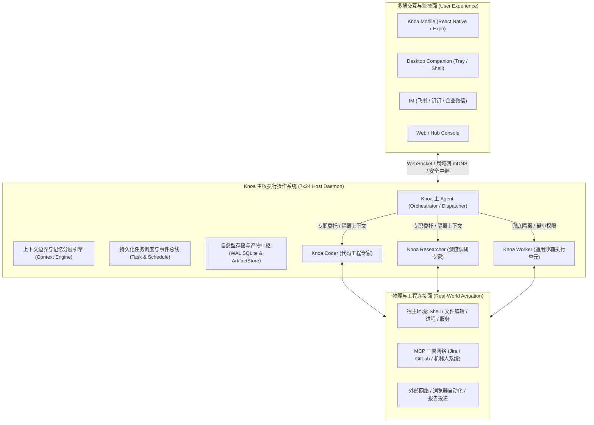

# Knoa 产品本质审视与 Jira 工程分析能力进阶

> **版本**: 1.0  
> **日期**: 2026-09-08  
> **状态**: 已定稿  

---

## 1. 概述

### 1.1 背景与目标
随着大模型 Agent 技术的快速迭代，业界充斥着大量以“对话框套壳”、“单体 Prompt 堆砌工具”为主的玩具型应用。这些应用普遍存在长时运行崩溃、上下文无限膨胀、单次请求 Token 成本失控、以及无法真正穿透本地物理与工程环境等致命问题。

本文件旨在完成两大核心使命：
1. **产品本质与核心价值审视**：彻底厘清 Knoa 究竟是什么、它如何真正为用户创造高杠杆价值、以及它与传统 Chatbot / Agent 的本质代差。
2. **Jira MCP 与工业级缺陷诊断能力演进**：结合实际工程中成熟的全局 Jira 分析体系（`oss://` 匿名存储解析、Tempo 机器人日志/Bag 提取、机器 SN 缺陷聚类分析、领域业务信号提取），给出将通用 Jira MCP 升级为“工业级缺陷智能分析闭环”的完整架构方案。

---

## 2. Knoa 产品本质审视：我们究竟是什么？

### 2.1 Knoa 绝不是什么（反向定义）
- **不是网页套壳 Chatbot**：不是给 Claude 或 ChatGPT 简单包一个 Web 界面；页面关闭，一切终止。
- **不是单体巨石 Prompt 运行时**：不是把 50 个工具直接塞给一个万能 Prompt，让它在同一个对话上下文里从头猜到尾，导致单轮消耗数万 Token 且执行频频翻车。
- **不是虚幻的云端 SaaS 玩具**：不要求用户把企业代码库、本地私有日志和高权限凭证拱手上传到第三方云端服务。

### 2.2 Knoa 的核心定义
> **Knoa 是一款面向个人与工程师的“主权常驻型虚拟数字员工与执行操作系统”（Sovereign Personal AI OS & Autonomous Co-Worker）。**

用户只需要描述意图与期望达成的目标，Knoa 负责自主理解、安全预检、任务分解、调度专职 Agent、调用本地与网络工具执行、在关键风险点请求人类确认、保存不可变证据，并在用户离线时**7×24 小时不间断运行、自愈并跨端同步结果**。



---

## 3. Knoa 如何给用户提供无可替代的价值？

### 3.1 价值一：从“同步实时问答”升维到“异步目标委托”
- **传统方式**：用户守在屏幕前，打一段字，等模型吐字，发现格式不对再纠偏，耗费大量脑力与时间。
- **Knoa 价值**：
  - 用户说：“每天早上 9 点帮我生成一份包含国内要闻与前沿科技的晨报并弹窗提醒”；
  - 用户说：“帮我巡检 Jira 综测缺陷，把分配给我的工单关联的现场机器人 Log 下载并排查是否有崩溃栈，整理出初步根因”；
  - 用户交代完即可离开，Knoa 在后台以小时为周期异步推进、重试恢复、自愈网络波动，并在完成时通过手机推送最终交付物。

### 3.2 价值二：组织化架构击碎“Token 成本与上下文污染”
- **工程痛点**：单 Agent 处理复杂任务（如一边阅读 100 篇网页，一边修改 5 个代码文件）会导致对话历史急剧膨胀，单次交互 Token 突破十万，既慢又贵，且极易产生注意力分散与幻觉。
- **Knoa 价值**：
  - 遵循 **“Direct First, Specialist When Proven, General Worker as Isolation Fallback”** 原则；
  - 主 Agent 仅维持精简上下文与编排计划，重型探索完全委托给专职 Agent（如 `researcher` 跑 30 步网页检索后只带回 500 字提炼精华；`coder` 在独立会话读写代码测试后只返回根因补丁证据）；
  - 主会话永远纯净高效，Token 消耗降低 70%~90%。

### 3.3 价值三：工业级可信性与长周期免维护自愈
- **真实生产环境运行验证**：
  - **存储自愈**：SQLite 数据库引入分级截断与自动 WAL 检查点，超时任务轨迹与大字段自动压缩清理，空闲页高效复用；
  - **产物全生命周期**：区分 `borrowed`（借用用户文件绝不冗余拷贝和误删）、`temporary`（1小时 TTL 自动物理回收）、`persistent`（持久归档），彻底避免磁盘无限膨胀；
  - **安装包与日志自动淘汰**：移动端历史安装包保留最新 3 代（释放 2.6GB+ 空间），Windows 服务更新脚本滚动保留，无需人工删日志打补丁。

---

## 4. 全局 Jira 分析 Skill 深度调研与能力对比

当前开发机全局环境下，存在一套成熟且经历过工业实践检验的 Jira 分析技能（`~/.agents/skills/jira/`），其能力远超传统的通用 Jira 工具，具有极高的借鉴与整合价值。

### 4.1 全局 Jira Skill 的核心优势
1. **中文业务字段动态映射**：
   - 传统 MCP 只能输出 `customfield_11118` 等随机哈希字段名，模型无法理解；
   - 该 Skill 会自动缓存并双向映射为 `"机器SN"`、`"客户名称"`、`"归属产品"`、`"发生时间"` 等直观中文键。
2. **打通机器人/工业日志大文件下载链路（破局点）**：
   - 现场机器人发生故障时，几百 MB 到数 GB 的 ROS 日志、Bag 包和音频文件**不可能直接挂在 Jira 附件中**；
   - 实际工单是通过 `oss://gs-public-shared/...` 匿名公网链接，或者 Tempo 云平台分享链接 `shared-record-list/...` 进行传递；
   - 该 Skill 内置了免鉴权直接拉取阿里云 OSS 的客户端（`oss_client.py`），以及集成机器人统一云认证、按机器所在大区（中国/欧洲/北美）动态路由终端节点的 Tempo 客户端（`tempo_client.py`），使 Agent 能直接下载原始运行日志！
3. **同设备硬件缺陷关联分析（`--sn-relate`）**：
   - 提取工单中的机器 SN，自动聚合该机器的历史同类工单，帮助研发一眼识别究竟是“单机偶发硬件老化”还是“共性软件缺陷”。
4. **业务信号与领域识别引擎（`assess_issue.py`）**：
   - 基于规则与正则自动提炼核心信号：是否涉及电梯联动（梯控）、是否属于运动规划避障（PNC）、是否缺失关键日志、是否需要总部二线研发介入。
5. **结构化质量分析输出模板**：
   - 强制采用工业级闭环规范：`*1/4问题描述*`、`*2/4原因分析*`、`*3/4改善措施*`，并自动转换为 Jira Wiki Markup 格式。

### 4.2 现状能力鸿沟（Gap Analysis）

| 维度 | Knoa 现有 Jira MCP (`examples/jira_mcp_server`) | 全局 Jira 分析 Skill (`~/.agents/skills/jira`) | 演进目标（Knoa Jira 进阶方案） |
|---|---|---|---|
| **协议标准** | 标准 MCP（stdio / JSON-RPC），具备资源订阅模型 | Python 独立 CLI 脚本（标准输出 JSON） | 保持标准 MCP 规范，封装底层能力 |
| **自定义字段** | 仅支持原始 `customfield_xxx` 字段 | 自动拉取元数据映射为中文人类可读键 | **MCP 原生支持字段元数据翻译** |
| **大文件日志链** | 仅支持 Jira 本地附件下载（无法下载现场日志） | 原生支持 `oss-cp`、`tempo-cp` 下载 Bag/Log | **MCP 集成 OSS 与 Tempo 工业日志下载器** |
| **硬件同频关联** | 无 | 支持 `--sn-relate` 聚合同机器历史故障 | **新增 `jira.find_related_by_sn` 工具** |
| **缺陷诊断闭环** | 仅停留在工单字段读写 | 具备信号提炼，但无法全自动解包诊断代码 | **联动 Coder / Worker 完成本地日志解包排查** |

---

## 5. Jira MCP 与 Agent 能力进阶架构设计

### 5.1 进阶架构全景

```mermaid
flowchart TD
    User([用户发起委托: "排查 SELLSERVIC-12345 缺陷根因"]) --> KnoaDispatcher[Knoa 主 Agent / 调度器]
    
    subgraph DefectWorkflow["缺陷诊断专属流水线 (Defect Analysis Pipeline)"]
        KnoaDispatcher -->|委派任务 + 隔离上下文| DefectAgent[Knoa Defect Specialist / Worker]
        
        subgraph JiraMCPEnhanced["增强型 Jira MCP Server"]
            ToolIssue["jira.get_issue (含中文字段映射 & 信号提炼)"]
            ToolOSS["jira.download_oss_evidence (零依赖 OSS 下载)"]
            ToolTempo["jira.download_tempo_records (Tempo 云日志直连)"]
            ToolSN["jira.correlate_by_sn (同机器历史故障聚类)"]
            ToolComment["jira.add_quality_comment (标准三段式确认回写)"]
        end

        DefectAgent -->|1. 获取工单与外部日志链接| ToolIssue
        DefectAgent -->|2. 聚合同设备历史故障| ToolSN
        DefectAgent -->|3. 下载现场 Log / Bag| ToolOSS & ToolTempo
        
        subgraph LocalDiagnostics["本地诊断与源码定位 (Host Actuation)"]
            ExtractLog["解包日志 / 归档 (tar / zip / zstd)"]
            GrepErrors["grep_search / 正则提取 Fatal / Crash 栈"]
            CodeInspection["read_file / inspect_code 定位出错行"]
        end

        ToolOSS & ToolTempo -->|下载至 evidence 目录| ExtractLog
        ExtractLog --> GrepErrors --> CodeInspection
        CodeInspection --> DefectAgent
    end

    DefectAgent -->|4. 提炼根因与补丁建议| KnoaDispatcher
    KnoaDispatcher --> UserReview{用户审查 & 审批确认}
    UserReview -->|批准| ToolComment
    UserReview -->|修改后批准| ToolComment
```

### 5.2 增强型 Jira MCP 工具集详细规划

1. **`jira.get_issue` 升级**：
   - 自动包含动态字段映射，输出中文属性字典（如 `"客户名称"`、`"机器SN"`、`"归属产品"`）；
   - 自动识别并提取内容中的外部凭据：解析出 `oss_links: ["oss://gs-public-shared/..."]` 与 `shared_record_links: [".../shared-record-list/..."]`；
   - 自动提取业务特征标签（梯控、PNC、二线流转、数据缺失）。
2. **`jira.download_oss_evidence`（新增）**：
   - **输入**：`issue_key`, `oss_url`（如 `oss://gs-public-shared/defect_logs/2026/09/xxx.log.tar.gz`）；
   - **行为**：利用公共读快速下载通道，直接以流式写入当前工单的 `evidence/` 目录，计算 SHA-256 并返回本地路径。
3. **`jira.download_tempo_records`（新增）**：
   - **输入**：`issue_key`, `record_ids`, 可选 `share_id`；
   - **行为**：调用机器人云端开放 API，拉取状态为 `AVAILABLE` 的 Bag/Log 原始记录，写入本地工作区。
4. **`jira.correlate_by_sn`（新增）**：
   - **输入**：`serial_number`, `limit`；
   - **行为**：执行 JQL `cf[机器SN] ~ "SN" ORDER BY created DESC`，返回同设备历史工单列表与解决状态，识别惯发故障。
5. **`jira.add_quality_comment`（升级写工具）**：
   - 强制格式规范化校验（1/4 现象，2/4 根因，3/4 措施），自动添加 AI 标识与 Wiki 标记语法，并纳入高风险确认阻断。

### 5.3 联动 Agent 的本地自动化诊断闭环
当增强型 Jira MCP 提供完整的外部证据后，Knoa 的多 Agent 架构优势将彻底释放：
- **第一阶段（数据就绪）**：Jira MCP 将远程分散在云端、机器端的工单元数据、图片和几百 MB 日志收集到受控目录；
- **第二阶段（本地算力闭环）**：Agent 在本地调用 `run_command`（解包）、`grep_search`（正则搜索段错误、`FATAL`、`Exception`）、`read_file`（比对本地代码库相关行）；
- **第三阶段（高可信输出）**：不靠虚无的想象，而是基于真实的日志堆栈、代码行号和同机器历史记录，生成具备极高可信度的技术排查报告。

---

## 6. L3 远期愿景架构：确定性验证器驱动的闭环演进 (Verifier-Driven Evolution & Autonomous Coworker)

### 6.1 行业祛魅：为什么单纯的 "Memory / Reflection" 不是真自进化？
截至 2026 年下半年，学术界与工业界（如 2026-08 《On the Fragility of Self-Improving Agents》、Microsoft Research 2026-06/08 综述与 EvoTest、SelfMem 等前沿成果）已经对所谓“自进化 Agent”进行了严肃反思与深度祛魅：

1. **自嗨式反思与记忆的脆弱性**：
   - 很多早期的“自省（Reflection）”或“纯记忆（Memory-only）”自进化实验，在更换任务顺序或多次复测后分数严重缩水。多步 Agent 本身噪声很大，叠加无约束的自我反思后，往往只是**记住了最近的局部经历、过拟合了任务次序，甚至形成模型间的互吹自嗨（Self-referential Feedback Loop）**。
2. **唯一真相来源：独立确定性验证器 (Independent Verifier)**：
   - Microsoft Research 的最新结论非常明确：**自我进化最有效的场景，必然存在独立于 Agent 自身的物理/逻辑 Verifier**。
   - 如果缺乏可靠、独立、确定性的评价信号（如编译器、单元测试、数据断言、物理执行结果），所谓的“自我演进”必然退化为指标投机、幻觉自证，甚至随着迭代越来越差。

因此，Knoa 坚决不搞“大而全、宣传式的通用自进化”，而是构建**基于确定性验证器的硬核工程演进体系**。

```mermaid
flowchart TD
    subgraph ExecutionPlane["1. 确定性执行与追踪面"]
        Agent[Knoa Agent: Coder / Worker] -->|运行任务| ExecEnv[执行沙箱 / 本地环境]
        ExecEnv -->|输出全量调用与日志| Trace[Execution Trace]
    end

    subgraph VerifierPlane["2. 独立验证器中枢 (Independent Verifier)"]
        Trace --> Evaluator[独立评测器 (Compiler / Unit Tests / Assertions)]
        Evaluator -->|硬核度量信号: 编译通过? 100个测试通过率?| Signal[Measurable Delta]
    end

    subgraph EvolutionGate["3. 基准评测与晋级门禁 (Eval & Promotion Gate)"]
        Signal --> Candidate[生成改进候选 (Runbook / Tool Patch / Prompt 微调)]
        Candidate --> BenchmarkSuite[回归评测集 (100 Benchmark Evals)]
        BenchmarkSuite --> PassRateCheck{通过率显著提升且零劣化?}
        PassRateCheck -->|是 (如 92% -> 96%)| Promote[正式晋级 (Promote to Agent Profile)]
        PassRateCheck -->|否 (退化或无提升)| Reject[废弃并告警 (Reject Candidate)]
    end

    subgraph StagedAction["4. 物料化交付与审批 (Staged Action Cards)"]
        Promote --> StagedCard[物料化决策卡片 (Action Card)]
        StagedCard --> OperatorApprove{宿主人类确认}
        OperatorApprove -->|批准| Production[投入生产使用]
    end
```

### 6.2 任务可验证性分级矩阵 (Verifier Strength Matrix)
Knoa 将任务严格按照“验证器强度”划定自进化的权限天花板，绝不跨越红线：

| 任务类型 | 验证器可信度 | 验证器实现来源 | 允许的演进等级 | Knoa 落地策略 |
|---|---|---|---|---|
| **C++ / Rust / Python 代码实现** | ★★★★★ (极高) | `compile` / `pytest` / ASan / CI 退出码 | **允许自动化生成补丁与单测闭环晋级** | 优先由 Coder Agent 承接失败回放 |
| **SQL 查询与数据清洗转换** | ★★★★★ (极高) | Schema 约束 / 结果集哈希比对 / 语法检查 | **允许自动化修复与模式缓存** | 确定性函数沉淀 |
| **现场日志分析与错误栈提取** | ★★★★☆ (高) | 日志行号真实性 / 错误码匹配 / 源码行定位 | **允许规则与特征签名自动提取** | 沉淀为特定异常的诊断 Runbook |
| **GUI 自动化与系统状态运维** | ★★★★☆ (高) | 进程状态 / 端口监听 / 文件系统断言 | **仅限沙箱中验证通过后方可沉淀** | 确定性运维步骤 |
| **行业调研与知识检索 (Researcher)** | ★★☆☆☆ (低) | 引用源 URL 可达性 / 交叉比对 / 用户点赞 | **仅做经验与参考源积累，严禁改写核心 Prompt** | 知识库更新 |
| **邮件撰写 / 人际沟通 / 开放文案** | ★☆☆☆☆ (极弱) | 主观审美偏好（缺乏客观真理） | **严格禁止自主修改行为逻辑** | 仅保留原始历史由用户判断 |

### 6.3 演进工程铁律：从“可积累”到“自修改”
Knoa 的能力演进遵循严密的工程递进次序，严禁倒置：

$$\text{Agent Profile} \longrightarrow \text{Execution Trace} \longrightarrow \text{Experience Library} \longrightarrow \text{Benchmark Eval} \longrightarrow \text{Verified Improvement} \longrightarrow \text{Self-Modification}$$

1. **第一步：Trace 与经验可积累（已进入工程化）**：
   - 记录每一次复杂排查与编写代码的执行轨迹，提炼高置信度的 `Error Signature`（错误特征签名）与 `Runbook`；
2. **第二步：独立 Verifier 与 Benchmark 回归集（L3 关键基石）**：
   - 沉淀失败用例库（Failures Cluster）。任何修改提议必须在包含数十到上百个真实用例的测试集上自动化运行；
3. **第三步：门禁式晋级（Promotion Gate）**：
   - 拒绝“我觉得我变强了”。只有在 Benchmark 上量化得分提升（如 $92\% \to 96\%$），并且在核心指标零劣化的前提下，系统才允许将经验或策略注入到下一代 Profile 中。

### 6.4 协同辅助支柱：主动感知晨报与物料化决策
在保持 Verifier 强约束的同时，保留两项务实的高价值功能：
- **主动晨间早报 (Proactive Morning Standup)**：7×24h 守护进程在清晨低峰期通过轻量探针巡检 Git PR、Jira 工单增量与磁盘状态，合成结构化简报推送给移动端；
- **物料化草稿沙盒 (Staged Action Cards)**：所有复杂诊断与修复全部打包为带 Diff、测试日志、回写工单文本的 Action Cards，交付用户一键批准，**把人类留在最终决策环路上（Human-in-the-loop）**。

---

## 7. 演进路线图：从 L1 走向 L3

```
┌─────────────────────────────────────────────────────────────┐
│ 远期愿景 (L3): 确定性验证器驱动的闭环演进                     │
│ • 独立验证器门禁 (Independent Verifier: Compiler / Tests / Assert)│
│ • 任务可验证性分级 (Coder/SQL 强闭环 vs Researcher 溯源弱进化)   │
│ • 严防自嗨式反思：先做经验与用例积累，再做受控优化与晋级门禁   │
│ • 主动环境感知与晨间早会 (Proactive Morning Standup)         │
│ • 物料化决策卡片 (Staged Action Cards & One-click Approve)  │
│ • 端云双轨认知路由 (Local Tier-0 7B + Cloud Tier-1 SOTA)    │
├─────────────────────────────────────────────────────────────┤
│ 中期突破 (L2 - 立即落地实施): 工业级工程闭环                 │
│ • Jira 工业级日志拓展: 集成 OSS 匿名下载与 Tempo 云日志直连   │
│ • Jira 中文业务字段动态缓存与双向映射                        │
│ • 机器 SN 同频缺陷聚类关联分析                              │
│ • 工业级三段式质量评论自动回写与安全确认                      │
│ • 联动 Coder / Worker 完成本地现场 Log/Bag 解包与代码定位    │
├─────────────────────────────────────────────────────────────┤
│ 近期地基 (L1 - 生产级已就绪):                               │
│ • 7×24h 无头常驻守护、自愈与自动轮转（WAL 截断、版本淘汰）     │
│ • CEO-Specialist 组织架构 (knoa + coder + researcher)       │
│ • 移动端 App / 跨平台部署 / 动态记忆防膨胀                    │
└─────────────────────────────────────────────────────────────┘
```

1. **第一阶段：L3 远期蓝图确立与文档定稿（已完成）**
   - 确立 Knoa 主权常驻虚拟员工的核心定位；
   - 梳理自繁衍技能、主动感知早会与端云双轨路由的完整架构。
2. **第二阶段：L2 工业级 Jira MCP 全面扩充（当前立即推进）**
   - 将 `oss_client` 与 `tempo_client` 整合进 `examples/jira_mcp_server`；
   - 补齐中文字段动态翻译与 `--sn-relate` 聚类工具；
   - 编写自动化测试保证工业下载链路高可用。
3. **第三阶段：L2+ 缺陷闭环流水线打通**
   - 联动 Coder 实现本地日志提取、Fatal 错误栈搜索与源码比对；
   - 在移动端与桌面端实现一键审批卡片。
