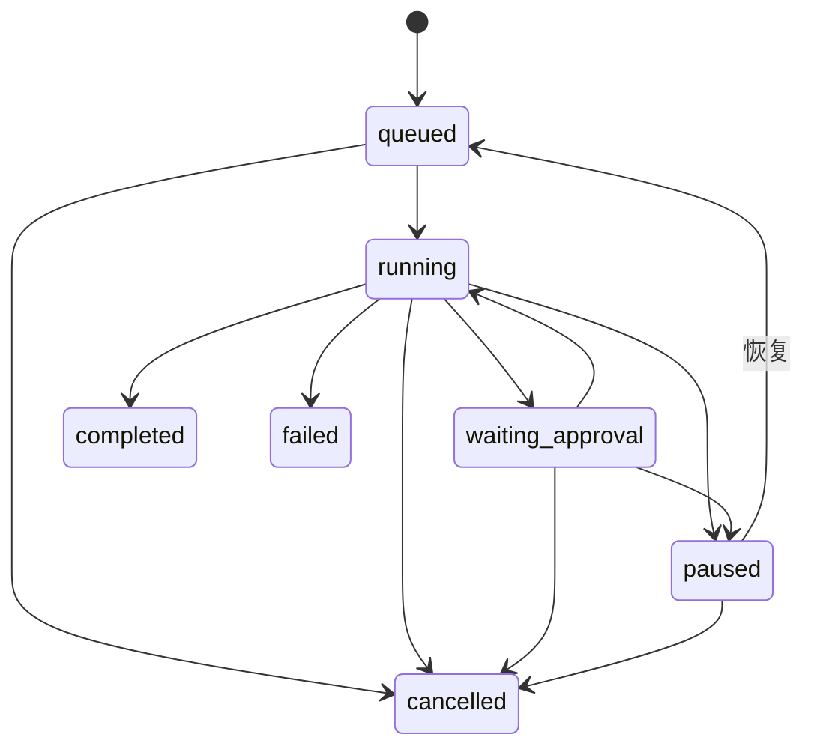

# 小诺 Task 产品设计

## 1. 唯一产品概念

用户只需要理解一个核心概念：**任务（Task）**。

Task 表示“小诺要做什么，以及什么时候启动”。普通聊天不是 Task；只有用户明确
委派独立工作、在任务页创建，或任务的定时/事件条件满足时才开始一次独立执行。

Conversation、ChatTurn、Session 上下文和 Channel 绑定见
[knoa-conversation-design.md](./knoa-conversation-design.md)。

```text
Task
  ├── 目标与附件
  ├── 启动方式
  │    ├── 立即执行
  │    ├── 定时执行
  │    └── 事件启动
  └── 执行记录
       ├── 第一次执行
       ├── 第二次执行
       └── ...
```

产品界面不出现 Job、Trigger、Activation、Run 或 Attempt。

## 2. 专业内部模型

```text
Task                 任务定义
TaskLaunchPolicy     启动方式
TaskLaunch           某一次启动事件，仅内部使用
TaskExecution        某一次执行
ExecutionAttempt     执行恢复尝试，仅内部使用
```

`TaskExecution` 使用独立 Agent Session，断开 Channel 后仍继续。第一版一个
TaskExecution 只由一个 Agent 执行，不实现 Subagent。

### 2.1 TaskLaunchPolicy

```text
immediate
scheduled
  ├── one_time
  ├── interval
  └── cron
event
  ├── webhook
  ├── jira
  ├── gitlab
  └── file_change
```

Schedule 不再是独立产品实体；它是 Task 的一种启动方式。原 Trigger 术语从产品
和公共领域模型中删除，事件启动只是另一种 `TaskLaunchPolicy`。

### 2.2 TaskLaunch

立即点击、时间到点、外部事件到达都会生成类型化 `TaskLaunch`。它负责持久去重、
claim、lease 和有界重试。只有统一的启动分发器可以创建 `TaskExecution`。

### 2.3 TaskExecution

每次执行具有稳定 ID、状态、阶段、权限确认、事件时间线、产物和最终结果。



“再次执行”生成新的 TaskExecution；同一次执行内部因进程恢复产生的技术尝试记录为
ExecutionAttempt，不向用户暴露。

## 3. 创建闭环

### 3.0 Agent 工具面

Agent 只注入两个紧凑的 Task 工具，内部 Schedule 记录不进入提示词：

- `create_task(title, goal, launch)`：按显式 launch policy 创建 Task；
- `task(action, task_id/execution_id)`：统一 list/get/update/pause/resume/archive/
  restore/delete/execute，以及 Execution 的暂停、恢复、取消、rerun 和删除。

`launch.kind` 支持 `immediate`、`one_time`、`interval` 和 `cron`。所有提供给 Agent
的工具名、说明、字段描述、示例和错误信息统一使用英语。`schedule_id`、`trigger_id`、
Occurrence、Launch 和 Attempt 都是 Core 内部实现名，Agent 不应向用户复述。查询和
控制必须使用公开 `task_id`，不能要求 Agent 先判断底层存储类型。
Agent 与 App 必须复用同一 Task 生命周期协调层；Task 启停、归档、恢复、修改和删除
都要同步其内部 Schedule/Trigger。Agent 查询结果返回公开 launch 配置、启动器状态和
下次执行时间，不返回内部 provider ID。Task 与终态 Execution 删除属于危险操作，
必须经过用户确认。

### 3.1 聊天委派

用户明确说“放后台做”“完成后告诉我”时，当前聊天 Agent 创建 Task：

- 立即开始的独立工作使用 `immediate`；
- 单次未来执行使用 `one_time`；
- 固定间隔或日历周期分别使用 `interval`、`cron`；
- 外部条件使用 `event`；
- 当前对话立即返回任务回执，不等待执行完成。

Agent 只有在目标完整、可以独立推进且不会扩大权限时才能主动建议或创建 Task。
普通问答不能因为模型响应慢而自动变成 Task。

### 3.2 任务页创建

任务页支持输入目标、照片、文件和启动方式。创建 immediate Task 后立即生成第一条
执行记录；scheduled/event Task 保存为启用状态，并允许“立即执行”。

### 3.3 执行与交付

```text
TaskLaunch
   ↓
TaskExecution
   ↓
独立 Agent Session
   ↓
标准事件流
   ├── App Push + 任务结果页
   ├── 飞书结果卡片
   └── CLI 查询
```

TaskExecution 可以读取 principal 级长期记忆，但不复制无限聊天全文。委派只传递
明确目标、附件和有界上下文，避免阻塞或污染当前聊天。

## 4. 状态和控制

- 暂停发生在安全边界；
- 恢复继续同一 TaskExecution；
- 取消显式改变执行状态，断线本身不取消；
- 再次执行创建新 TaskExecution，并保留历史；
- 修改 Task 启动方式只影响未来执行；
- 暂停 Task 表示停止未来定时/事件启动，不强制终止当前执行；
- 当前执行的暂停/取消是独立操作。

App 和飞书最终调用相同的 Core 命令，不在 Channel 中实现状态机。

## 5. 查询和筛选

任务列表筛选的是 Task 及其最新执行状态：

- 进行中：最新执行为 queued/running/paused；
- 待确认：最新执行为 waiting_approval；
- 已完成：最新执行为 completed；
- 未完成：最新执行为 failed/cancelled；
- 已计划：启动方式为 scheduled/event 且 Task 启用。

筛选必须由服务端在分页之前执行，不能先取一页内部执行记录再由客户端猜测。

## 6. 结果展示

Task 详情先展示任务目标和启动方式，再展示执行记录。执行详情顺序为：

1. 最终结论；
2. 产物和附件；
3. 关键执行步骤；
4. 可展开完整事件时间线。

流式文本必须合并后渲染；Markdown 使用完整宽度；长结果不得在 Core 或 Channel
层截断，超出单卡展示能力时附加完整 Markdown 产物。

### 6.1 执行记录与 Trace 保留

`TaskExecution` 的用户可见结果和 `ExecutionTrace` 使用不同生命周期：

- Execution 的状态、最终结论、错误、usage 汇总、关键步骤、审批结果和 Artifact
  引用随 Task 长期保存；
- 完整 Trace 默认保留 90 天，用于评估、调试和复盘；
- Trace 内按 iteration/语义段合并 reasoning 和 content draft，不保存逐 token 事件；
- Trace 到期后压缩，保留关键工具步骤、错误、耗时、token 统计和最终结果，淘汰
  reasoning 草稿、正文草稿及大体积原始工具结果；
- 运行中、暂停中、待确认的 Execution 不得淘汰；
- 删除 Task 时才级联删除其 Execution 记录，Artifact 字节按独立保留策略处理。

这样 Task 详情长期可读，评估窗口内又有足够的完整运行证据，同时不会让模型 chunk
持续撑大 principal feed 或数据库。

## 7. Channel 能力

| 能力 | App | 飞书 |
|---|---|---|
| 创建 Task | 聊天委派、任务页 | 自然语言委派 |
| 查看 Task | 列表和详情 | `/tasks`、`/task <id>` |
| 立即执行 | 按钮 | `/execute <id>` |
| 暂停/启用未来启动 | 按钮 | `/task-pause <id>`、`/task-resume <id>` |
| 暂停/恢复当前执行 | 按钮 | `/pause <execution-id>`、`/resume <execution-id>` |
| 取消当前执行 | 按钮 | `/cancel <execution-id>` |
| 再次执行 | 按钮 | `/retry <execution-id>` |
| 权限确认 | 执行内按钮 | 同一执行卡片按钮 |
| 完成通知 | Push + 结果页 | 主动结果卡片 |
