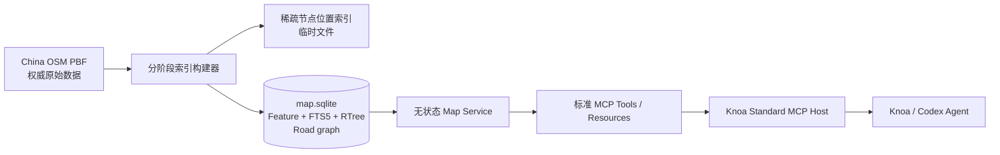

# 设计: 中国离线地图 MCP

> 类型: 需求设计
> 来源: MAP-MCP-001（当前会话提出的本地特性）
> 需求文档: 当前会话中“基于 `/disk/osm` 中国全量地图实现完整地图 MCP”的需求
> 需求结论: 交付可由 Knoa 直接部署的中国离线地图 MCP，覆盖地点、地址、周边、路线、距离和坐标转换能力。
> 架构结论: 采用 PBF 权威源、可重建 SQLite 查询库、无状态 MCP 服务三层架构，构建过程分阶段提交并可安全重跑。
> 交付范围: `examples/osm_map_mcp_server`、对应测试、构建和部署说明、中国全量离线数据环境
> 首要风险: 中国 OSM 的 POI 和地址覆盖不均衡，服务必须返回数据来源与覆盖状态，不能把无结果解释为地点不存在。
> 创建时间: 2026-09-30
> 更新时间: 2026-09-30
> 代码位置: examples/osm_map_mcp_server, tests/test_osm_map_mcp_example.py

## 需求

本需求交付一个可离线运行的中国地图 MCP，使 Agent 能把自然语言地点和设备坐标转换成可验证的地理结果，并完成周边检索与基础路线规划。原始数据使用 `/disk/osm/extracts/china-latest.osm.pbf`；该文件头声明的覆盖范围为东经 73.41788° 至 134.803619°、北纬 14.27437° 至 53.65559°，复制时间为 2026-09-27T20:23:36Z。

现有实现不能继续使用。`/disk/osm/mcp/server.py` 查询不存在的 `features`、`features_fts` 和 `features_rtree` 表，`mcp.yaml` 声明的工具名与服务实现不一致。现有 C++ 导入器使用按全球最大节点编号分配的 `DenseFileArray`，实际生成 106 GiB 的位置文件；导入在提交前终止，`china.db` 的业务表均为 0 行且 `PRAGMA quick_check` 报告损坏页。

最终功能包括：

- 按名称、别名、品牌、地址和 OSM 分类搜索地点，支持行政区范围与坐标偏置；
- 由坐标返回行政区层级、附近地址、道路和 POI；
- 按半径、关键字和类别检索周边地点；
- 读取稳定地点标识对应的详情与 OSM 来源；
- 基于 OSM 道路拓扑提供步行、骑行和驾车路线；
- 计算直线距离，并为有界输入计算道路距离；
- 在 WGS84、GCJ-02 和 BD-09 之间转换坐标；
- 通过 MCP Resource 暴露数据版本、覆盖范围、构建状态和类别清单。

地点类请求在热缓存条件下的目标响应时间为 2 秒以内，10 公里城市路线的目标响应时间为 10 秒以内。所有列表均设置服务端上限，单次 Tool 结果保持有界。无匹配、数据未构建、路线不连通、路线搜索达到资源上限分别返回稳定错误码。

OSM PBF 不包含可靠的中国公交时刻、实时路况和天气。数据集状态明确把这三类能力标记为 `unsupported`，由其他 MCP 提供这些数据。

## 架构设计

采用 PBF 权威源、可重建 SQLite 查询库、无状态 MCP 服务三层架构。MCP 服务只读打开完成构建的数据库；构建器不参与在线请求；Knoa 通过标准 stdio MCP 启动服务。

| 组件 | 职责 | 所有者 | 接口 |
|---|---|---|---|
| PBF | 保存可重新生成全部派生数据的 OSM 快照 | 本地数据管理员 | OSM PBF |
| 构建器 | 流式读取 PBF，生成地点、边界、空间索引和路网 | 地图 MCP 包 | CLI |
| SQLite 查询库 | 保存只读查询模型和构建元数据 | 地图 MCP 包 | SQLite schema v1 |
| Map Service | 执行文本、空间、几何和路线算法 | 地图 MCP 包 | Python API |
| MCP 适配器 | 暴露标准 Tools 和 Resources，执行输入与输出约束 | 地图 MCP 包 | MCP stdio |
| Knoa Host | 生命周期、Tool policy、超时、取消和可观测性 | Knoa Core | 标准 MCP Client |

内部坐标统一为 WGS84，经纬度字段始终分开命名。GCJ-02 和 BD-09 仅在输入归一化与输出编码边界转换。SQLite 文件是 PBF 的派生缓存，不接受在线写入，也不保存用户位置历史。

## 详细设计

核心实现采用统一 `features` 表承载地点、地址、道路、区域和行政边界，使用 FTS5 二元中文分词索引完成中文子串检索，使用 RTree 完成包围盒筛选；路网使用 `route_nodes` 和有方向权限掩码的 `route_edges`，运行时用有界 A* 搜索。

### 数据构建

构建器按以下提交边界运行：

1. 创建带 `build_state=building` 的数据库并保存 PBF 大小、修改时间、复制时间和覆盖范围。
2. 使用 libosmium `sparse_file_array` 保存 PBF 中实际出现的节点坐标。临时索引按节点数量增长，不按最大 OSM ID 分配。
3. 流式写入 feature 与 road graph 基表，每批提交；稳定唯一键使重复扫描保持幂等。
4. 基表完成后批量创建 FTS5、RTree 和邻接索引。
5. 执行行数、外键、RTree 对齐、随机查询和 `PRAGMA quick_check`。全部通过后原子写入 `build_state=ready`。

构建中断后数据库保持 `building`，MCP 拒绝提供业务查询并返回 `dataset_not_ready`。临时库可以安全删除并从保留的 PBF 重建；生产 C++ 构建器不尝试恢复处于未知事务边界的中间库。验证以构建命令退出码为 0、`quick_check=ok`、五类 feature 均有记录、route node/edge 均有记录为成功标准。

机械盘随机写是本机的主要瓶颈。生产构建把 SQLite 主文件放在 NVMe 的 `/tmp/osm-map-database-build`，把可释放的稀疏位置索引和 SQLite 排序溢出放在 `/disk/dev/osm-map-index`。验证完成后仅向 `/disk/dev/osm-map-live` 做一次顺序复制并原子激活，避免在机械盘上构建 1 亿级邻接索引。

### 数据更新

PBF 长期保留为本地权威快照，SQLite 仅是可丢弃的查询派生物。更新器读取 PBF 头中的 `osmosis_replication_base_url` 和 sequence，使用 `pyosmium-up-to-date` 下载 Geofabrik 增量差分并生成旁路 PBF。差分可以分批追平，任何下载或合并失败都不修改当前 PBF。

更新后的 PBF 在工作目录生成，随后在 NVMe 构建目录触发旁路全量索引构建。新数据库通过完整验证后，更新器把 PBF 和 SQLite 分别顺序复制到各自目标目录的 `.next` 文件，再原子轮换；上一版分别保留为 `.previous`。数据库激活失败时自动恢复上一版 PBF，避免源数据与查询库版本不一致。MCP 每次查询只读打开当前 SQLite，不扫描 PBF，更新期间继续服务上一版数据库。每日执行一次更新可把正常数据时延控制在 24 小时以内；PBF 已是最新版本时不重复建库。

SQLite 不直接消费 `.osc.gz`。OSM 对 way、relation、删除和节点移动的依赖传播需要重新组装几何和路网，直接增量修改查询库容易留下悬空边与旧边界；当前 1.5 GiB 中国快照采用旁路重建，以构建时间换取可验证的一致性。验收以新 PBF replication sequence 增长、新 SQLite 的 replication timestamp 与其一致、旧版本仍可回滚为成功标准。

### 查询模型

`features` 保存稳定 OSM 来源、类型、名称与别名、品牌、地址字段、行政级别、中心点、包围盒、必要几何和受控标签。公开 `place_id` 由 `osm_type/osm_id/feature_type` 组成，不暴露 SQLite 行号。`feature_fts` 保存标准化名称、中文二元词、品牌、地址和分类别名。`features_rtree` 保存所有 feature 包围盒。

地点搜索先由 FTS 取最多 300 个候选，再按名称精确度、前缀、feature 类型、人口、坐标距离和文本相关性排序。行政区筛选先解析行政区 feature 的包围盒，再参与候选查询。周边检索先用 RTree 截取圆的包围盒，再用 Haversine 距离做精确过滤。

逆地理编码先用 RTree 找出候选行政边界，再用 Polygon/MultiPolygon 点包含判断确认层级；随后在有界半径内查找地址、道路和 POI。结果返回每一级行政区及其 OSM 来源，并提供最近对象的实际距离。测试以边界内、边界外、洞、多面和无附近对象五类样例验收。

### 路线模型

每个连续道路节点对形成一条 `route_edges` 记录，分别保存正向和反向的步行、骑行、驾车权限位。权限由 `highway`、`access`、`foot`、`bicycle`、`motor_vehicle`、`oneway` 和 `junction` 标签确定。距离使用球面距离，时间按交通方式、道路等级、限速和路面得到确定性估计。

路线请求先把文本地点解析为坐标，再吸附到允许该交通方式的最近路网节点。A* 使用球面时间下界，设置 20 秒和 250000 个已展开节点的双重上限。成功结果返回吸附误差、总距离、预计时长、合并后的道路步骤和最多 500 点的简化折线；达到上限返回 `route_search_limit`，不返回不完整路线。验收覆盖单行道、步行专用路、驾车禁行、断开路网、同点路线和坐标吸附。

### MCP 契约

MCP Tools 固定为 `map.search_places`、`map.reverse_geocode`、`map.nearby_search`、`map.get_place`、`map.route`、`map.distance`、`map.convert_coordinates` 和 `map.dataset_info`。全部声明为只读、本地、幂等能力，并同时返回 text content 与 structured content。`map://dataset` 和 `map://categories` 是只读 Resources。

所有字符串、列表、半径、结果数、矩阵大小和路线搜索量均在 schema 与服务实现中重复约束。工具错误返回 `isError=true` 及稳定 `code`，日志只记录工具名、耗时和错误类型，不记录用户精确坐标。MCP 集成测试通过 Knoa 的 `StdioMCPClient` 完成 tools/list、resources/list 与代表性 tools/call 验收。

## 影响评估

本设计新增一个独立 MCP 包，不修改 Knoa Core 的业务分支；最高风险是全量构建耗时与 OSM 覆盖差异。构建器通过稀疏位置索引、分批提交、状态标记和幂等重扫控制构建失败风险，服务通过数据集元信息让 Agent识别覆盖边界。

| 影响对象 | 当前状态 | 目标状态 | 处理结论 |
|---|---|---|---|
| `/disk/osm` 原始数据 | PBF 可读，旧 DB 损坏，位置索引异常膨胀 | PBF 保持权威源 | 不修改原始 PBF；旧产物仅作为故障证据 |
| Knoa Core | 已支持标准 MCP package | 直接加载地图 MCP | 不增加地图专用分支 |
| MCP package | 旧服务 schema 与 manifest 不一致 | 新 package 契约一致且可测试 | 使用新目录替换部署，不兼容旧工具名 |
| 本地存储 | 旧构建不可恢复 | 查询库可重建、可检测状态 | NVMe 构建，机械盘保存成品库和临时索引，home 使用符号链接 |
| 用户位置 | 设备端按需提供 | 仅在单次只读查询内使用 | 不持久化位置历史 |
| 网络 | 逆地理编码依赖公网 Photon | 地图核心查询离线运行 | 地图 MCP 不声明 network capability |

发布顺序为：合入 MCP 包和测试，完成中国 PBF 全量构建并保存构建报告，使用 `knoa mcp-package-deploy` 部署，通过真实上海、北京、广州、县级区域和跨城区路线样例验收，再把设备位置逆地理编码切换到本地地图能力。数据库可随时由 PBF 重建；回滚时停用 `osm-map` MCP package 并恢复原有 Photon enrichment。构建 `quick_check` 失败、代表性城市搜索为空或城市路线无法完成任一条件触发回滚。证据回填到 `gs-records/specs/MAP-MCP-001/`；代码测试、全量构建报告和部署健康检查全部通过后关闭 MAP-MCP-001。

## 全量构建与验收结果

2026-09-30 使用 `libosmium-cpp-v1` 对 `/disk/osm/extracts/china-latest.osm.pbf` 完成全量构建。PBF 大小为 1,600,384,205 字节，replication sequence 为 4922，replication timestamp 为 `2026-09-27T20:23:36Z`。构建从 04:51:51 UTC 到 05:39:43 UTC，共 47 分 52 秒；SQLite 成品为 21,588,025,344 字节，SHA-256 为 `cdd30ac4b1fa7c85db1dd7771c92fc511ee0d6b698a5114a92438cdaade1dee1`。

最终记录数为 4,745,908 个 feature、98,241,267 个 route node 和 102,784,644 个 route edge。其中 place 576,208、POI 1,395,431、road 1,873,343、boundary 34,590、address 170,709。`PRAGMA quick_check`、基础表与 FTS/RTree 行数对齐及中文 `上海` FTS 查询均通过，数据库状态为 `ready`。

真实数据验收覆盖北京故宫搜索、广州塔和深圳北站搜索、上海人民广场附近逆地理与周边查询，以及上海城区步行和驾车路线。上海样例的逆地理耗时 35 ms、周边查询 7 ms、1.1 km 步行路线 14 ms、1.5 km 驾车路线 8 ms。MCP stdio 验收返回 8 个 Tool、2 个 Resource，并成功执行 `map.dataset_info`、北京区域搜索和上海逆地理。

生产库已经复制到 `/disk/dev/osm-map-live/china.sqlite`，复制后 SHA-256 与 NVMe 构建产物一致；Knoa 后台服务已发现 `map://dataset` 与 `map://categories`。每日 03:20 的更新任务已安装。当前主机访问 `download.geofabrik.de` 超时，因此自动更新会保留 replication sequence 4922 并记录失败；网络恢复后下一次任务会继续追平差分并原子发布。
